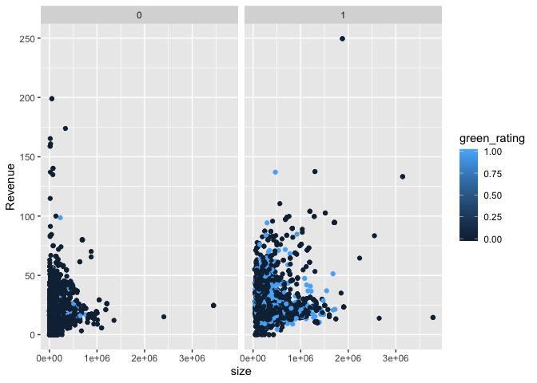
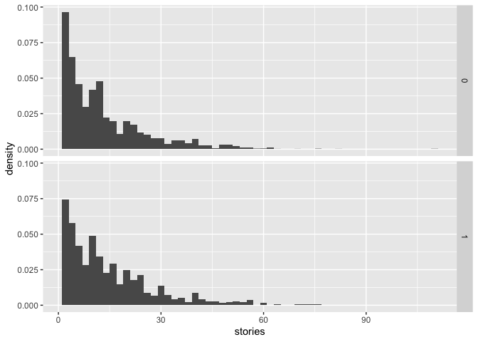
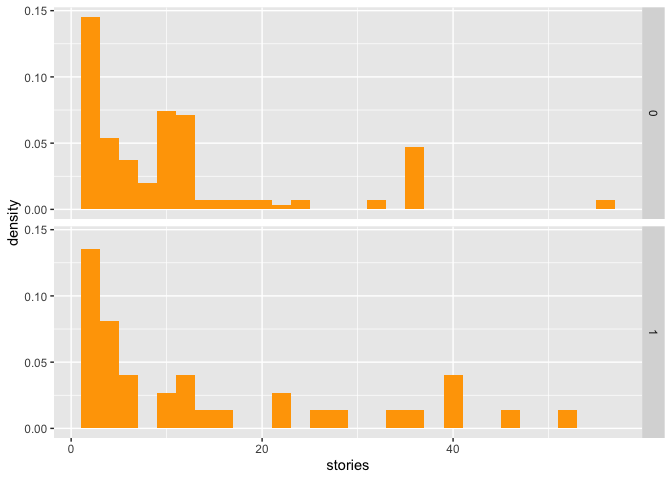
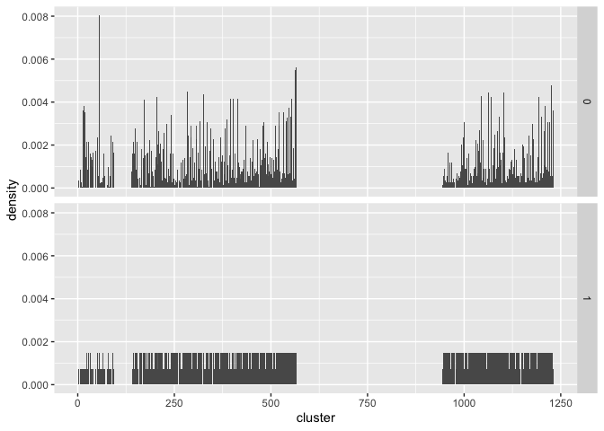
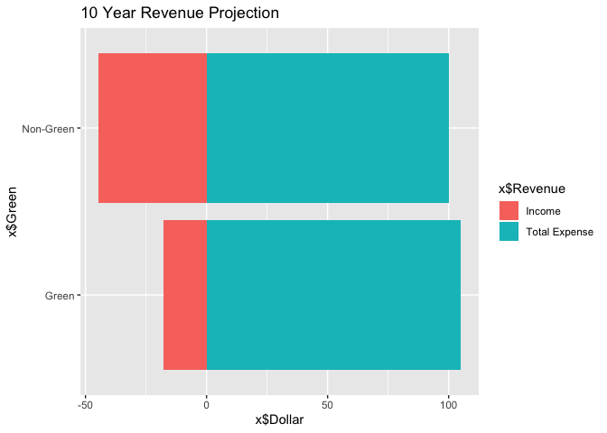
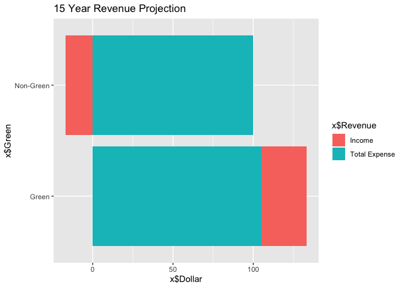
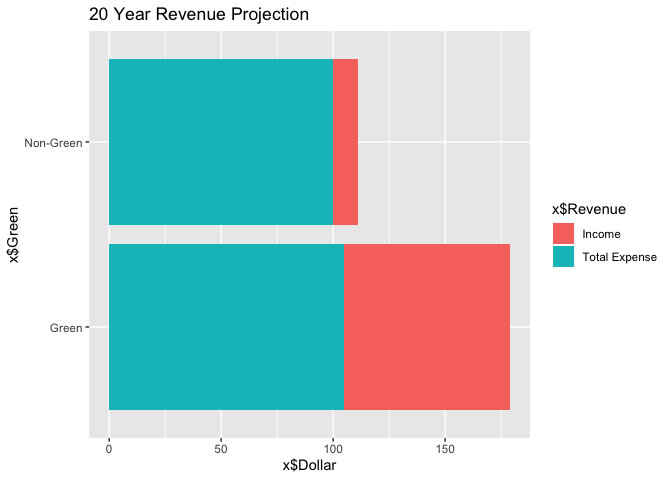

``` r
library(readr)
library(dplyr)
```

    ## 
    ## Attaching package: 'dplyr'

    ## The following objects are masked from 'package:stats':
    ## 
    ##     filter, lag

    ## The following objects are masked from 'package:base':
    ## 
    ##     intersect, setdiff, setequal, union

``` r
green <- read.csv('/Users/CatherineMiao/Desktop/STA380-master/data/greenbuildings.csv') %>% as.tbl
head(green)
```

    ## # A tibble: 6 x 23
    ##   CS_PropertyID cluster   size empl_gr  Rent leasing_rate stories   age
    ##           <int>   <int>  <int>   <dbl> <dbl>        <dbl>   <int> <int>
    ## 1        379105       1 260300    2.22  38.6         91.4      14    16
    ## 2        122151       1  67861    2.22  28.6         87.1       5    27
    ## 3        379839       1 164848    2.22  33.3         88.9      13    36
    ## 4         94614       1  93372    2.22  35           97.0      13    46
    ## 5        379285       1 174307    2.22  40.7         96.6      16     5
    ## 6         94765       1 231633    2.22  43.2         92.7      14    20
    ## # … with 15 more variables: renovated <int>, class_a <int>, class_b <int>,
    ## #   LEED <int>, Energystar <int>, green_rating <int>, net <int>,
    ## #   amenities <int>, cd_total_07 <int>, hd_total07 <int>,
    ## #   total_dd_07 <int>, Precipitation <dbl>, Gas_Costs <dbl>,
    ## #   Electricity_Costs <dbl>, cluster_rent <dbl>

``` r
green$leasing_rate = (green$leasing_rate * .01)
revenue = (green$Rent * green$leasing_rate)
green$Revenue = revenue
```

class a buildings tend to be larger in size and greener
=======================================================

``` r
library(ggplot2)
ggplot(data = green)+
  geom_point(mapping = aes(x=size, y=Revenue, color=green_rating))+
  facet_wrap(~ class_a)
```

 \# From the density plot, we identify that green buildings tend to have more stories.

``` r
ggplot(green) + 
  geom_histogram(aes(x=stories, y=stat(density)), binwidth=2) + 
  facet_grid(green_rating~.)
```

 \# The density plot shows that green buildings which are 5 years old and younger tend to have more stories than non-green buildings

``` r
library(dplyr)
green123 = green %>%
  filter(age <6) 

ggplot(green123) + 
  geom_histogram(aes(x=stories, y=stat(density)), binwidth=2,fill="orange") + 
  facet_grid(green_rating~.)#+ scale_fill_gradient("density", low="green", high="red")
```



Green buildings are better clustered than non-green buildings
=============================================================

``` r
attach(green)
ggplot(green) + 
  geom_histogram(aes(x=cluster, y=stat(density)), binwidth=2) + 
  facet_grid(green_rating~.)
```



``` r
greenbuildings <- read.csv('/Users/CatherineMiao/Desktop/STA380-master/data/greenbuildings.csv') %>% as.tbl

greenbuildings$Revenue = revenue
greenbuildings$leasing_rate = (greenbuildings$leasing_rate * .01)
revenue = (greenbuildings$Rent * greenbuildings$leasing_rate)
```

Income Porjection
=================

In the 10-year project, both green and nongreen buildings have negative incomes
===============================================================================

``` r
total_green2 = ((((36.86412*250000)*10)-5000000)/1000000) 
total_nongreen2 = (((22.17286*250000)*10)/1000000) 
GreenBuilding = (total_green2)
NonGreenBuilding = (total_nongreen2)
NonGreenCost = 100
GreenCost = 105
df = data.frame(Years=c(10),NonGreenBuilding, GreenBuilding, GreenCost, NonGreenCost)
Income1= GreenBuilding-GreenCost
Income2 =NonGreenBuilding-NonGreenCost
x <- data.frame("Green" = c("Green", "Non-Green"), "Dollar" = c(105,100,-17.8397, -44.56785), "Revenue" = c("Total Expense","Total Expense","Income","Income"), stringsAsFactors = FALSE)
x
```

    ##       Green    Dollar       Revenue
    ## 1     Green 105.00000 Total Expense
    ## 2 Non-Green 100.00000 Total Expense
    ## 3     Green -17.83970        Income
    ## 4 Non-Green -44.56785        Income

``` r
ggplot(data = x, aes(x = x$Green, y =x$Dollar, fill = x$Revenue)) + 
    geom_bar(stat="identity")+ coord_flip() +ggtitle('10 Year Revenue Projection')
```



In the 15-year Projection, the income for green buildings becomes positive, but the income for non-green buildings are still negative
=====================================================================================================================================

``` r
total_green3 = ((((36.86412*250000)*15)-5000000)/1000000) 
total_nongreen3 = (((22.17286*250000)*15)/1000000) 
GreenBuilding = (total_green3)
NonGreenBuilding = (total_nongreen3)
NonGreenCost = 100
GreenCost = 105
df = data.frame(Years=c(15),NonGreenBuilding, GreenBuilding, GreenCost, NonGreenCost)
Income1 = GreenBuilding - GreenCost 
Income2 = NonGreenBuilding - NonGreenCost
x <- data.frame("Green" = c("Green", "Non-Green"), "Dollar" = c(105,100,28.24045, -16.85178), "Revenue" = c("Total Expense","Total Expense","Income","Income"), stringsAsFactors = FALSE)
x
```

    ##       Green    Dollar       Revenue
    ## 1     Green 105.00000 Total Expense
    ## 2 Non-Green 100.00000 Total Expense
    ## 3     Green  28.24045        Income
    ## 4 Non-Green -16.85178        Income

``` r
ggplot(data = x, aes(x = x$Green, y =x$Dollar, fill = x$Revenue)) + 
    geom_bar(stat="identity")+ coord_flip() +ggtitle('15 Year Revenue Projection')
```



In the 20-year Projection, the income for green buildings largely exceeds non-green buildings
=============================================================================================

``` r
total_green = ((((36.86412*250000)*20)-5000000)/1000000) 
total_nongreen = (((22.17286*250000)*20)/1000000) 
GreenBuilding = (total_green)
NonGreenBuilding = (total_nongreen)
x <- data.frame("Green" = c("Green", "Non-Green"), "Dollar" = c(105,100,74, 11), "Revenue" = c("Total Expense","Total Expense","Income","Income"), stringsAsFactors = FALSE)
x
```

    ##       Green Dollar       Revenue
    ## 1     Green    105 Total Expense
    ## 2 Non-Green    100 Total Expense
    ## 3     Green     74        Income
    ## 4 Non-Green     11        Income

``` r
ggplot(data = x, aes(x = x$Green, y =x$Dollar, fill = x$Revenue)) + 
    geom_bar(stat="identity")+ coord_flip() +ggtitle('20 Year Revenue Projection')#+scale_fill_brewer(palette = 11)
```


