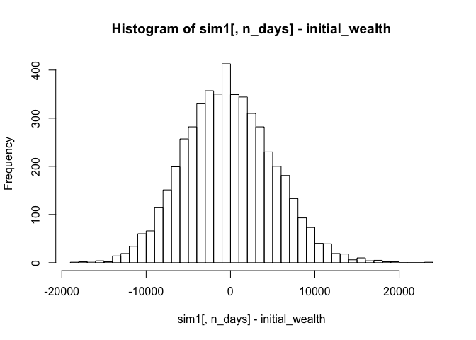
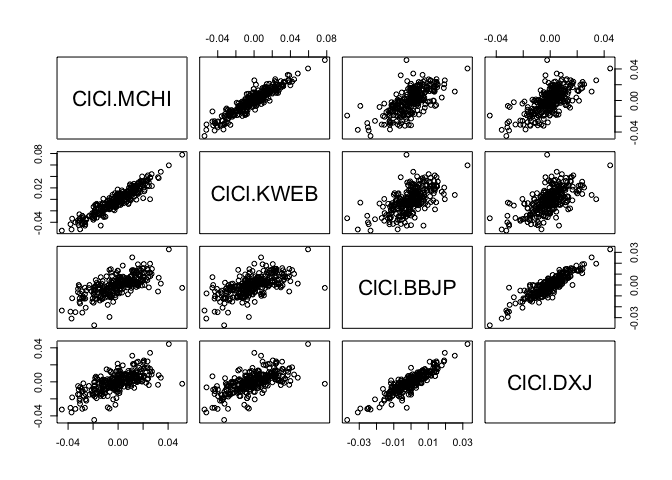

**The goal of this analysis is to understand if the VaR differs across different regions. We look at three different areas, first is the emerging market, second is China/Japan, third is the western market, US and Europe.**

### 1. Emerging market

For the emerging market, we choose 5 ETFs.

The emerging market portfolio has a 20-day 5% VaR of around USD 8,000, which is an 8% loss of the initial wealth.

``` r
library(mosaic)
```

    ## Loading required package: dplyr

    ## 
    ## Attaching package: 'dplyr'

    ## The following objects are masked from 'package:stats':
    ## 
    ##     filter, lag

    ## The following objects are masked from 'package:base':
    ## 
    ##     intersect, setdiff, setequal, union

    ## Loading required package: lattice

    ## Loading required package: ggformula

    ## Loading required package: ggplot2

    ## Loading required package: ggstance

    ## 
    ## Attaching package: 'ggstance'

    ## The following objects are masked from 'package:ggplot2':
    ## 
    ##     geom_errorbarh, GeomErrorbarh

    ## 
    ## New to ggformula?  Try the tutorials: 
    ##  learnr::run_tutorial("introduction", package = "ggformula")
    ##  learnr::run_tutorial("refining", package = "ggformula")

    ## Loading required package: mosaicData

    ## Loading required package: Matrix

    ## 
    ## The 'mosaic' package masks several functions from core packages in order to add 
    ## additional features.  The original behavior of these functions should not be affected by this.
    ## 
    ## Note: If you use the Matrix package, be sure to load it BEFORE loading mosaic.

    ## 
    ## Attaching package: 'mosaic'

    ## The following object is masked from 'package:Matrix':
    ## 
    ##     mean

    ## The following object is masked from 'package:ggplot2':
    ## 
    ##     stat

    ## The following objects are masked from 'package:dplyr':
    ## 
    ##     count, do, tally

    ## The following objects are masked from 'package:stats':
    ## 
    ##     binom.test, cor, cor.test, cov, fivenum, IQR, median,
    ##     prop.test, quantile, sd, t.test, var

    ## The following objects are masked from 'package:base':
    ## 
    ##     max, mean, min, prod, range, sample, sum

``` r
library(quantmod)
```

    ## Loading required package: xts

    ## Loading required package: zoo

    ## 
    ## Attaching package: 'zoo'

    ## The following objects are masked from 'package:base':
    ## 
    ##     as.Date, as.Date.numeric

    ## 
    ## Attaching package: 'xts'

    ## The following objects are masked from 'package:dplyr':
    ## 
    ##     first, last

    ## Loading required package: TTR

    ## Version 0.4-0 included new data defaults. See ?getSymbols.

``` r
library(foreach)

mystocks = c("VWO", "IEMG", "EEM",  "SPEM", "FNDE")
getSymbols(mystocks, from=as.Date('2014-8-17'))
```

    ## 'getSymbols' currently uses auto.assign=TRUE by default, but will
    ## use auto.assign=FALSE in 0.5-0. You will still be able to use
    ## 'loadSymbols' to automatically load data. getOption("getSymbols.env")
    ## and getOption("getSymbols.auto.assign") will still be checked for
    ## alternate defaults.
    ## 
    ## This message is shown once per session and may be disabled by setting 
    ## options("getSymbols.warning4.0"=FALSE). See ?getSymbols for details.

    ## [1] "VWO"  "IEMG" "EEM"  "SPEM" "FNDE"

``` r
usesymbols = list(VWO,  IEMG,   EEM,    SPEM,   FNDE)

# Combine close to close changes in a single matrix
all_returns = cbind(    ClCl(VWO),
                                ClCl(IEMG),
                                ClCl(EEM),
                                ClCl(SPEM),
                                ClCl(FNDE))

all_returns = as.matrix(na.omit(all_returns))

# Now simulate many different possible scenarios  
initial_wealth = 100000
sim1 = foreach(i=1:5000, .combine='rbind') %do% {
    total_wealth = initial_wealth
    weights = c(0.2, 0.2, 0.2, 0.2, 0.2)
    holdings = weights * total_wealth
    n_days = 20
    wealthtracker = rep(0, n_days)
    for(today in 1:n_days) {
        return.today = resample(all_returns, 1, orig.ids=FALSE)
        holdings = holdings + holdings*return.today
        total_wealth = sum(holdings)
        wealthtracker[today] = total_wealth
        holdings = weights * total_wealth
    }
    wealthtracker
}

pairs(all_returns)
```


``` r
hist(sim1[,n_days], 25)
```


``` r
# Profit/loss
mean(sim1[,n_days])
```

    ## [1] 99791.75

``` r
hist(sim1[,n_days]- initial_wealth, breaks=30)
```



``` r
quantile(sim1[,n_days]- initial_wealth,  .05)
```

    ##        5% 
    ## -8547.876

``` r
quantile(sim1[,n_days]- initial_wealth,  .05)/initial_wealth
```

    ##          5% 
    ## -0.08547876

### 2. China + Japan

We choose 2 ETFs for China market and 2 for Japan market.

China and Japan market portfolio has a 20-day 5% VaR of around USD 11,000, which is an 11% loss of the initial wealth.

``` r
mystocks = c("MCHI",    "KWEB", "BBJP", "DXJ")
getSymbols(mystocks, from=as.Date('2014-8-17'))
```

    ## [1] "MCHI" "KWEB" "BBJP" "DXJ"

``` r
# Combine close to close changes in a single matrix
all_returns = cbind(ClCl(MCHI),
                                ClCl(KWEB),
                                ClCl(BBJP),
                                ClCl(DXJ))

all_returns = as.matrix(na.omit(all_returns))

# Now simulate many different possible scenarios  
initial_wealth = 100000
sim1 = foreach(i=1:5000, .combine='rbind') %do% {
    total_wealth = initial_wealth
    weights = c(0.25, 0.25, 0.25, 0.25)
    holdings = weights * total_wealth
    n_days = 20
    wealthtracker = rep(0, n_days)
    for(today in 1:n_days) {
        return.today = resample(all_returns, 1, orig.ids=FALSE)
        holdings = holdings + holdings*return.today
        total_wealth = sum(holdings)
        wealthtracker[today] = total_wealth
        holdings = weights * total_wealth
    }
    wealthtracker
}

pairs(all_returns)
```



``` r
hist(sim1[,n_days], 25)
```


``` r
# Profit/loss
mean(sim1[,n_days])
```

    ## [1] 98393.87

``` r
hist(sim1[,n_days]- initial_wealth, breaks=30)
```


``` r
quantile(sim1[,n_days]- initial_wealth,  .05)
```

    ##       5% 
    ## -10777.2

``` r
quantile(sim1[,n_days]- initial_wealth,  .05)/initial_wealth
```

    ##        5% 
    ## -0.107772

### 3. US + Europe

We choose 2 all-cap stocks ETFs for the US market and 2 ETFs for the Europe market.

US + Europe market portfolio has a 20-day 5% VaR of around USD 6,500, which is a 6.5% loss of the initial wealth.

``` r
mystocks = c("IWR", "IWS", "VGK",   "BBEU")
getSymbols(mystocks, from=as.Date('2014-8-17'))
```

    ## [1] "IWR"  "IWS"  "VGK"  "BBEU"

``` r
usesymbols = list(IWR, IWS, VGK,    BBEU)

# Combine close to close changes in a single matrix
all_returns = cbind(ClCl(IWR),
                                ClCl(IWS),
                                ClCl(VGK),
                                ClCl(BBEU))

all_returns = as.matrix(na.omit(all_returns))

# Now simulate many different possible scenarios  
initial_wealth = 100000
sim1 = foreach(i=1:5000, .combine='rbind') %do% {
    total_wealth = initial_wealth
    weights = c(0.25, 0.25, 0.25, 0.25)
    holdings = weights * total_wealth
    n_days = 20
    wealthtracker = rep(0, n_days)
    for(today in 1:n_days) {
        return.today = resample(all_returns, 1, orig.ids=FALSE)
        holdings = holdings + holdings*return.today
        total_wealth = sum(holdings)
        wealthtracker[today] = total_wealth
        holdings = weights * total_wealth
    }
    wealthtracker
}

pairs(all_returns)
```


``` r
hist(sim1[,n_days], 25)
```


``` r
# Profit/loss
mean(sim1[,n_days])
```

    ## [1] 99698.71

``` r
hist(sim1[,n_days]- initial_wealth, breaks=30)
```


``` r
quantile(sim1[,n_days]- initial_wealth,  .05)
```

    ##        5% 
    ## -6346.373

``` r
quantile(sim1[,n_days]- initial_wealth,  .05)/initial_wealth
```

    ##          5% 
    ## -0.06346373

### Coclusion

The China/Japan market has the highest VaR. It's because China market went through two severe stock crashes in 2015-16 and 2018. The crashes contributed many negative return samples to bootstrap.

The US/Europe has the lowest VaR.
