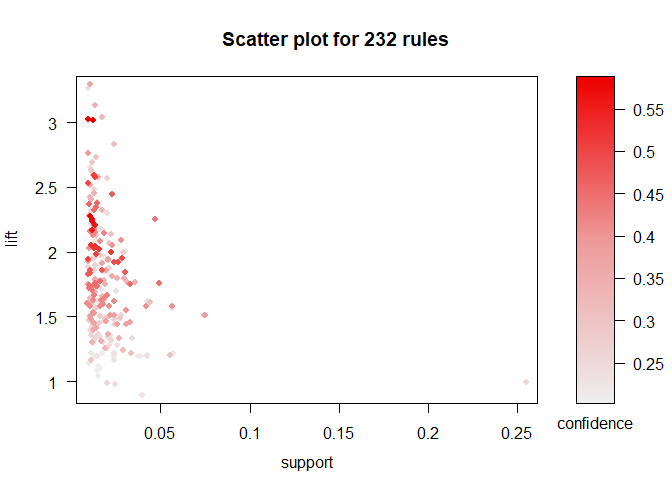
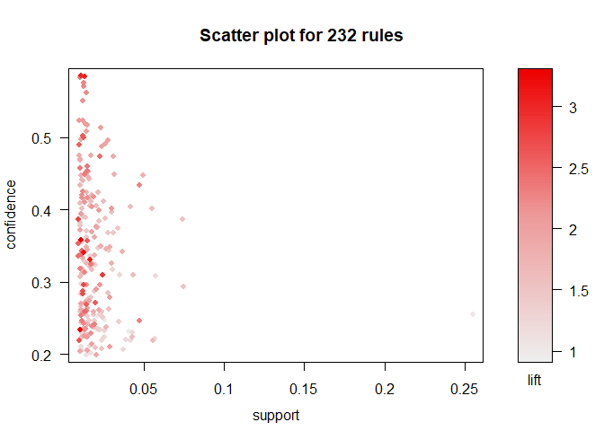
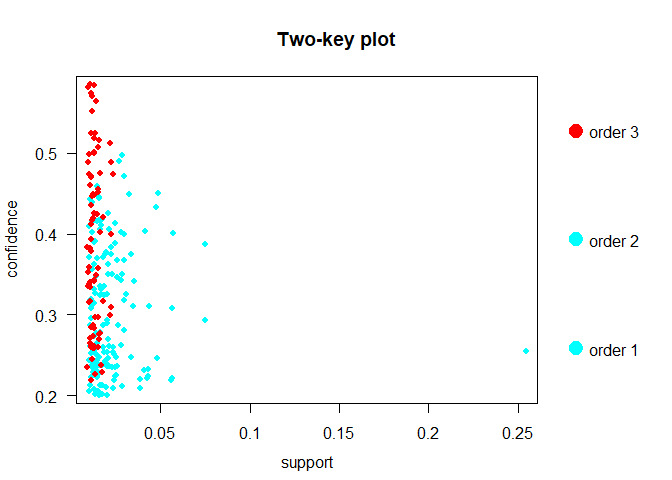
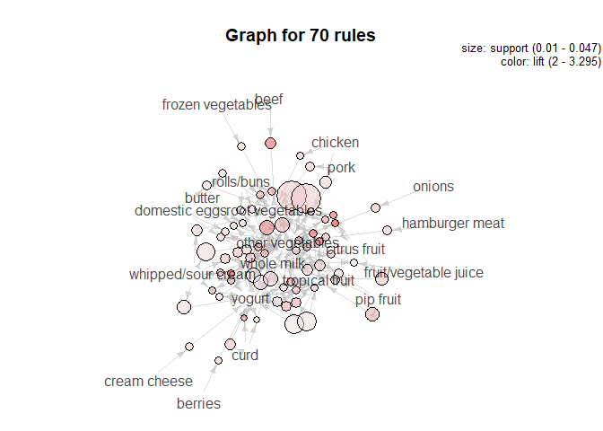
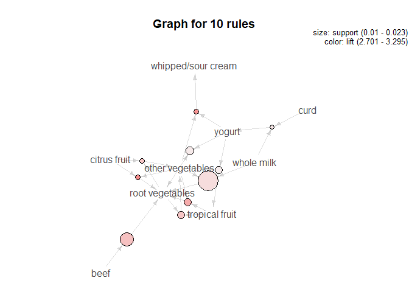

Question6 Association rule mining
================

# Read data

Read data files and create transactions
    object.

``` r
library(tidyverse)
```

    ## -- Attaching packages -------------------------------------------------- tidyverse 1.2.1 --

    ## v ggplot2 3.2.0     v purrr   0.3.2
    ## v tibble  2.1.3     v dplyr   0.8.3
    ## v tidyr   0.8.3     v stringr 1.4.0
    ## v readr   1.3.1     v forcats 0.4.0

    ## -- Conflicts ----------------------------------------------------- tidyverse_conflicts() --
    ## x dplyr::filter() masks stats::filter()
    ## x dplyr::lag()    masks stats::lag()

``` r
library(arules)  # has a big ecosystem of packages built around it
```

    ## Loading required package: Matrix

    ## 
    ## Attaching package: 'Matrix'

    ## The following object is masked from 'package:tidyr':
    ## 
    ##     expand

    ## 
    ## Attaching package: 'arules'

    ## The following object is masked from 'package:dplyr':
    ## 
    ##     recode

    ## The following objects are masked from 'package:base':
    ## 
    ##     abbreviate, write

``` r
library(arulesViz)
```

    ## Loading required package: grid

    ## Registered S3 method overwritten by 'seriation':
    ##   method         from 
    ##   reorder.hclust gclus

``` r
groceries = read.transactions("groceries.txt", sep=',')
summary(groceries)
```

    ## transactions as itemMatrix in sparse format with
    ##  9835 rows (elements/itemsets/transactions) and
    ##  169 columns (items) and a density of 0.02609146 
    ## 
    ## most frequent items:
    ##       whole milk other vegetables       rolls/buns             soda 
    ##             2513             1903             1809             1715 
    ##           yogurt          (Other) 
    ##             1372            34055 
    ## 
    ## element (itemset/transaction) length distribution:
    ## sizes
    ##    1    2    3    4    5    6    7    8    9   10   11   12   13   14   15 
    ## 2159 1643 1299 1005  855  645  545  438  350  246  182  117   78   77   55 
    ##   16   17   18   19   20   21   22   23   24   26   27   28   29   32 
    ##   46   29   14   14    9   11    4    6    1    1    1    1    3    1 
    ## 
    ##    Min. 1st Qu.  Median    Mean 3rd Qu.    Max. 
    ##   1.000   2.000   3.000   4.409   6.000  32.000 
    ## 
    ## includes extended item information - examples:
    ##             labels
    ## 1 abrasive cleaner
    ## 2 artif. sweetener
    ## 3   baby cosmetics

# Generate rules

We try apriori algorithm with 0.01 support and 0.2 confidence. This
choice will drop rarer purchases, but weaker relationships will be
kept.

``` r
groceriesrules <- apriori(groceries,parameter=list(support=.01, confidence=.2, maxlen=10))
```

    ## Apriori
    ## 
    ## Parameter specification:
    ##  confidence minval smax arem  aval originalSupport maxtime support minlen
    ##         0.2    0.1    1 none FALSE            TRUE       5    0.01      1
    ##  maxlen target   ext
    ##      10  rules FALSE
    ## 
    ## Algorithmic control:
    ##  filter tree heap memopt load sort verbose
    ##     0.1 TRUE TRUE  FALSE TRUE    2    TRUE
    ## 
    ## Absolute minimum support count: 98 
    ## 
    ## set item appearances ...[0 item(s)] done [0.00s].
    ## set transactions ...[169 item(s), 9835 transaction(s)] done [0.00s].
    ## sorting and recoding items ... [88 item(s)] done [0.00s].
    ## creating transaction tree ... done [0.00s].
    ## checking subsets of size 1 2 3 4 done [0.00s].
    ## writing ... [232 rule(s)] done [0.00s].
    ## creating S4 object  ... done [0.00s].

``` r
plot(groceriesrules, measure = c("support", "lift"), shading = "confidence")
```

    ## To reduce overplotting, jitter is added! Use jitter = 0 to prevent jitter.

<!-- -->

``` r
plot(groceriesrules, measure = c("support", "confidence"), shading = "lift")
```

    ## To reduce overplotting, jitter is added! Use jitter = 0 to prevent jitter.

<!-- -->

``` r
plot(groceriesrules, method='two-key plot')
```

    ## To reduce overplotting, jitter is added! Use jitter = 0 to prevent jitter.

<!-- -->

# Choose a subset

Greater lift values indicate stronger associations. We choose the rule
with a value greater than 2. The lift parameter ensures that very weak
relationships are still dropped. At these levels, we see that a variety
of grocery items–dairy, fruits, and meats–are associated with the
purchase of root vegetables. Furthermore, we also see that buying any
type of dairy (especially in conjunction with a produce item) is
associated with buying another type. That’s make sense in real life.

``` r
subset_grule <- subset(groceriesrules, subset=lift > 2)
inspect(subset_grule)
```

    ##      lhs                        rhs                     support confidence     lift count
    ## [1]  {onions}                => {other vegetables}   0.01423488  0.4590164 2.372268   140
    ## [2]  {berries}               => {yogurt}             0.01057448  0.3180428 2.279848   104
    ## [3]  {hamburger meat}        => {other vegetables}   0.01382816  0.4159021 2.149447   136
    ## [4]  {cream cheese}          => {yogurt}             0.01240468  0.3128205 2.242412   122
    ## [5]  {chicken}               => {root vegetables}    0.01087951  0.2535545 2.326221   107
    ## [6]  {chicken}               => {other vegetables}   0.01789527  0.4170616 2.155439   176
    ## [7]  {frozen vegetables}     => {root vegetables}    0.01159126  0.2410148 2.211176   114
    ## [8]  {beef}                  => {root vegetables}    0.01738688  0.3313953 3.040367   171
    ## [9]  {curd}                  => {yogurt}             0.01728521  0.3244275 2.325615   170
    ## [10] {pork}                  => {root vegetables}    0.01362481  0.2363316 2.168210   134
    ## [11] {butter}                => {root vegetables}    0.01291307  0.2330275 2.137897   127
    ## [12] {domestic eggs}         => {root vegetables}    0.01433655  0.2259615 2.073071   141
    ## [13] {whipped/sour cream}    => {root vegetables}    0.01708185  0.2382979 2.186250   168
    ## [14] {whipped/sour cream}    => {yogurt}             0.02074225  0.2893617 2.074251   204
    ## [15] {whipped/sour cream}    => {other vegetables}   0.02887646  0.4028369 2.081924   284
    ## [16] {pip fruit}             => {tropical fruit}     0.02043721  0.2701613 2.574648   201
    ## [17] {citrus fruit}          => {tropical fruit}     0.01992883  0.2407862 2.294702   196
    ## [18] {tropical fruit}        => {yogurt}             0.02928317  0.2790698 2.000475   288
    ## [19] {yogurt}                => {tropical fruit}     0.02928317  0.2099125 2.000475   288
    ## [20] {root vegetables}       => {other vegetables}   0.04738180  0.4347015 2.246605   466
    ## [21] {other vegetables}      => {root vegetables}    0.04738180  0.2448765 2.246605   466
    ## [22] {curd,                                                                              
    ##       yogurt}                => {whole milk}         0.01006609  0.5823529 2.279125    99
    ## [23] {curd,                                                                              
    ##       whole milk}            => {yogurt}             0.01006609  0.3852140 2.761356    99
    ## [24] {pork,                                                                              
    ##       whole milk}            => {other vegetables}   0.01016777  0.4587156 2.370714   100
    ## [25] {butter,                                                                            
    ##       other vegetables}      => {whole milk}         0.01148958  0.5736041 2.244885   113
    ## [26] {butter,                                                                            
    ##       whole milk}            => {other vegetables}   0.01148958  0.4169742 2.154987   113
    ## [27] {domestic eggs,                                                                     
    ##       other vegetables}      => {whole milk}         0.01230300  0.5525114 2.162336   121
    ## [28] {domestic eggs,                                                                     
    ##       whole milk}            => {other vegetables}   0.01230300  0.4101695 2.119820   121
    ## [29] {fruit/vegetable juice,                                                             
    ##       whole milk}            => {other vegetables}   0.01047280  0.3931298 2.031756   103
    ## [30] {whipped/sour cream,                                                                
    ##       yogurt}                => {other vegetables}   0.01016777  0.4901961 2.533410   100
    ## [31] {other vegetables,                                                                  
    ##       whipped/sour cream}    => {yogurt}             0.01016777  0.3521127 2.524073   100
    ## [32] {other vegetables,                                                                  
    ##       yogurt}                => {whipped/sour cream} 0.01016777  0.2341920 3.267062   100
    ## [33] {whipped/sour cream,                                                                
    ##       yogurt}                => {whole milk}         0.01087951  0.5245098 2.052747   107
    ## [34] {whipped/sour cream,                                                                
    ##       whole milk}            => {yogurt}             0.01087951  0.3375394 2.419607   107
    ## [35] {whipped/sour cream,                                                                
    ##       whole milk}            => {other vegetables}   0.01464159  0.4542587 2.347679   144
    ## [36] {other vegetables,                                                                  
    ##       pip fruit}             => {whole milk}         0.01352313  0.5175097 2.025351   133
    ## [37] {pip fruit,                                                                         
    ##       whole milk}            => {other vegetables}   0.01352313  0.4493243 2.322178   133
    ## [38] {citrus fruit,                                                                      
    ##       root vegetables}       => {other vegetables}   0.01037112  0.5862069 3.029608   102
    ## [39] {citrus fruit,                                                                      
    ##       other vegetables}      => {root vegetables}    0.01037112  0.3591549 3.295045   102
    ## [40] {other vegetables,                                                                  
    ##       root vegetables}       => {citrus fruit}       0.01037112  0.2188841 2.644626   102
    ## [41] {citrus fruit,                                                                      
    ##       whole milk}            => {yogurt}             0.01026945  0.3366667 2.413350   101
    ## [42] {citrus fruit,                                                                      
    ##       whole milk}            => {other vegetables}   0.01301474  0.4266667 2.205080   128
    ## [43] {root vegetables,                                                                   
    ##       tropical fruit}        => {other vegetables}   0.01230300  0.5845411 3.020999   121
    ## [44] {other vegetables,                                                                  
    ##       tropical fruit}        => {root vegetables}    0.01230300  0.3427762 3.144780   121
    ## [45] {other vegetables,                                                                  
    ##       root vegetables}       => {tropical fruit}     0.01230300  0.2596567 2.474538   121
    ## [46] {root vegetables,                                                                   
    ##       tropical fruit}        => {whole milk}         0.01199797  0.5700483 2.230969   118
    ## [47] {tropical fruit,                                                                    
    ##       whole milk}            => {root vegetables}    0.01199797  0.2836538 2.602365   118
    ## [48] {root vegetables,                                                                   
    ##       whole milk}            => {tropical fruit}     0.01199797  0.2453222 2.337931   118
    ## [49] {tropical fruit,                                                                    
    ##       yogurt}                => {other vegetables}   0.01230300  0.4201389 2.171343   121
    ## [50] {other vegetables,                                                                  
    ##       tropical fruit}        => {yogurt}             0.01230300  0.3427762 2.457146   121
    ## [51] {other vegetables,                                                                  
    ##       yogurt}                => {tropical fruit}     0.01230300  0.2833724 2.700550   121
    ## [52] {tropical fruit,                                                                    
    ##       yogurt}                => {whole milk}         0.01514997  0.5173611 2.024770   149
    ## [53] {tropical fruit,                                                                    
    ##       whole milk}            => {yogurt}             0.01514997  0.3581731 2.567516   149
    ## [54] {whole milk,                                                                        
    ##       yogurt}                => {tropical fruit}     0.01514997  0.2704174 2.577089   149
    ## [55] {tropical fruit,                                                                    
    ##       whole milk}            => {other vegetables}   0.01708185  0.4038462 2.087140   168
    ## [56] {other vegetables,                                                                  
    ##       whole milk}            => {tropical fruit}     0.01708185  0.2282609 2.175335   168
    ## [57] {root vegetables,                                                                   
    ##       yogurt}                => {other vegetables}   0.01291307  0.5000000 2.584078   127
    ## [58] {other vegetables,                                                                  
    ##       yogurt}                => {root vegetables}    0.01291307  0.2974239 2.728698   127
    ## [59] {root vegetables,                                                                   
    ##       yogurt}                => {whole milk}         0.01453991  0.5629921 2.203354   143
    ## [60] {root vegetables,                                                                   
    ##       whole milk}            => {yogurt}             0.01453991  0.2972973 2.131136   143
    ## [61] {whole milk,                                                                        
    ##       yogurt}                => {root vegetables}    0.01453991  0.2595281 2.381025   143
    ## [62] {rolls/buns,                                                                        
    ##       root vegetables}       => {other vegetables}   0.01220132  0.5020921 2.594890   120
    ## [63] {other vegetables,                                                                  
    ##       rolls/buns}            => {root vegetables}    0.01220132  0.2863962 2.627525   120
    ## [64] {rolls/buns,                                                                        
    ##       root vegetables}       => {whole milk}         0.01270971  0.5230126 2.046888   125
    ## [65] {rolls/buns,                                                                        
    ##       whole milk}            => {root vegetables}    0.01270971  0.2244165 2.058896   125
    ## [66] {root vegetables,                                                                   
    ##       whole milk}            => {other vegetables}   0.02318251  0.4740125 2.449770   228
    ## [67] {other vegetables,                                                                  
    ##       whole milk}            => {root vegetables}    0.02318251  0.3097826 2.842082   228
    ## [68] {other vegetables,                                                                  
    ##       yogurt}                => {whole milk}         0.02226741  0.5128806 2.007235   219
    ## [69] {whole milk,                                                                        
    ##       yogurt}                => {other vegetables}   0.02226741  0.3974592 2.054131   219
    ## [70] {other vegetables,                                                                  
    ##       whole milk}            => {yogurt}             0.02226741  0.2975543 2.132979   219

``` r
plot(subset_grule, method='graph')
```

<!-- -->

``` r
plot(head(subset_grule, 10, by='lift'), method='graph')
```

<!-- -->
