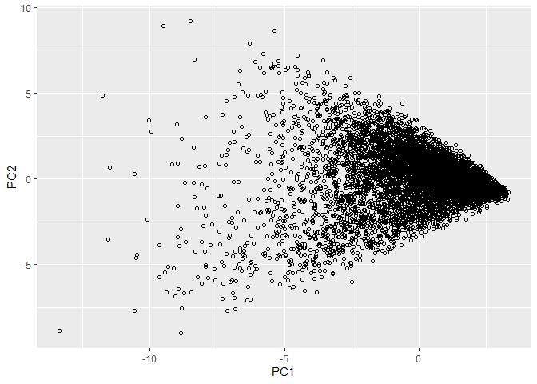

STA380\_Homework2
================

# Q1\_GreenBuilding

``` r
library(readr)
library(dplyr)
```

    ## 
    ## Attaching package: 'dplyr'

    ## The following objects are masked from 'package:stats':
    ## 
    ##     filter, lag

    ## The following objects are masked from 'package:base':
    ## 
    ##     intersect, setdiff, setequal, union

``` r
green <- read.csv('greenbuildings.csv') %>% as.tbl
head(green)
```

    ## # A tibble: 6 x 23
    ##   CS_PropertyID cluster   size empl_gr  Rent leasing_rate stories   age
    ##           <int>   <int>  <int>   <dbl> <dbl>        <dbl>   <int> <int>
    ## 1        379105       1 260300    2.22  38.6         91.4      14    16
    ## 2        122151       1  67861    2.22  28.6         87.1       5    27
    ## 3        379839       1 164848    2.22  33.3         88.9      13    36
    ## 4         94614       1  93372    2.22  35           97.0      13    46
    ## 5        379285       1 174307    2.22  40.7         96.6      16     5
    ## 6         94765       1 231633    2.22  43.2         92.7      14    20
    ## # ... with 15 more variables: renovated <int>, class_a <int>,
    ## #   class_b <int>, LEED <int>, Energystar <int>, green_rating <int>,
    ## #   net <int>, amenities <int>, cd_total_07 <int>, hd_total07 <int>,
    ## #   total_dd_07 <int>, Precipitation <dbl>, Gas_Costs <dbl>,
    ## #   Electricity_Costs <dbl>, cluster_rent <dbl>

``` r
green$leasing_rate = (green$leasing_rate * .01)
revenue = (green$Rent * green$leasing_rate)
green$Revenue = revenue
```

# class a buildings tend to be larger in size and greener

``` r
library(ggplot2)
ggplot(data = green)+
  geom_point(mapping = aes(x=size, y=Revenue, color=green_rating))+
  facet_wrap(~ class_a)
```

<!-- --> \#
From the density plot, we identify that green buildings tend to have
more stories.

``` r
ggplot(green) + 
  geom_histogram(aes(x=stories, y=stat(density)), binwidth=2) + 
  facet_grid(green_rating~.)
```

<!-- --> \#
The density plot shows that green buildings which are 5 years old and
younger tend to have more stories than non-green buildings

``` r
library(dplyr)
green123 = green %>%
  filter(age <6) 
ggplot(green123) + 
  geom_histogram(aes(x=stories, y=stat(density)), binwidth=2,fill="orange") + 
  facet_grid(green_rating~.)#+ scale_fill_gradient("density", low="green", high="red")
```

<!-- -->

# Green buildings are better clustered than non-green buildings

``` r
attach(green)
ggplot(green) + 
  geom_histogram(aes(x=cluster, y=stat(density)), binwidth=2) + 
  facet_grid(green_rating~.)
```

<!-- -->

``` r
greenbuildings <- read.csv('greenbuildings.csv') %>% as.tbl
greenbuildings$Revenue = revenue
greenbuildings$leasing_rate = (greenbuildings$leasing_rate * .01)
revenue = (greenbuildings$Rent * greenbuildings$leasing_rate)
```

# Income Porjection

# In the 10-year project, both green and nongreen buildings have negative incomes

``` r
total_green2 = ((((36.86412*250000)*10)-5000000)/1000000) 
total_nongreen2 = (((22.17286*250000)*10)/1000000) 
GreenBuilding = (total_green2)
NonGreenBuilding = (total_nongreen2)
NonGreenCost = 100
GreenCost = 105
df = data.frame(Years=c(10),NonGreenBuilding, GreenBuilding, GreenCost, NonGreenCost)
Income1= GreenBuilding-GreenCost
Income2 =NonGreenBuilding-NonGreenCost
x <- data.frame("Green" = c("Green", "Non-Green"), "Dollar" = c(105,100,-17.8397, -44.56785), "Revenue" = c("Total Expense","Total Expense","Income","Income"), stringsAsFactors = FALSE)
x
```

    ##       Green    Dollar       Revenue
    ## 1     Green 105.00000 Total Expense
    ## 2 Non-Green 100.00000 Total Expense
    ## 3     Green -17.83970        Income
    ## 4 Non-Green -44.56785        Income

``` r
ggplot(data = x, aes(x = x$Green, y =x$Dollar, fill = x$Revenue)) + 
    geom_bar(stat="identity")+ coord_flip() +ggtitle('10 Year Revenue Projection')
```

<!-- -->

# In the 15-year Projection, the income for green buildings becomes positive, but the income for non-green buildings are still negative

``` r
total_green3 = ((((36.86412*250000)*15)-5000000)/1000000) 
total_nongreen3 = (((22.17286*250000)*15)/1000000) 
GreenBuilding = (total_green3)
NonGreenBuilding = (total_nongreen3)
NonGreenCost = 100
GreenCost = 105
df = data.frame(Years=c(15),NonGreenBuilding, GreenBuilding, GreenCost, NonGreenCost)
Income1 = GreenBuilding - GreenCost 
Income2 = NonGreenBuilding - NonGreenCost
x <- data.frame("Green" = c("Green", "Non-Green"), "Dollar" = c(105,100,28.24045, -16.85178), "Revenue" = c("Total Expense","Total Expense","Income","Income"), stringsAsFactors = FALSE)
x
```

    ##       Green    Dollar       Revenue
    ## 1     Green 105.00000 Total Expense
    ## 2 Non-Green 100.00000 Total Expense
    ## 3     Green  28.24045        Income
    ## 4 Non-Green -16.85178        Income

``` r
ggplot(data = x, aes(x = x$Green, y =x$Dollar, fill = x$Revenue)) + 
    geom_bar(stat="identity")+ coord_flip() +ggtitle('15 Year Revenue Projection')
```

<!-- -->

# In the 20-year Projection, the income for green buildings largely exceeds non-green buildings

``` r
total_green = ((((36.86412*250000)*20)-5000000)/1000000) 
total_nongreen = (((22.17286*250000)*20)/1000000) 
GreenBuilding = (total_green)
NonGreenBuilding = (total_nongreen)
x <- data.frame("Green" = c("Green", "Non-Green"), "Dollar" = c(105,100,74, 11), "Revenue" = c("Total Expense","Total Expense","Income","Income"), stringsAsFactors = FALSE)
x
```

    ##       Green Dollar       Revenue
    ## 1     Green    105 Total Expense
    ## 2 Non-Green    100 Total Expense
    ## 3     Green     74        Income
    ## 4 Non-Green     11        Income

``` r
ggplot(data = x, aes(x = x$Green, y =x$Dollar, fill = x$Revenue)) + 
    geom_bar(stat="identity")+ coord_flip() +ggtitle('20 Year Revenue Projection')#+scale_fill_brewer(palette = 11)
```

<!-- -->

# Q2\_Flights

First we wanted to get an understanding of the frequency of flights. We
did this by plotting how many flights there were by month, day of the
month and day of the week.

``` r
library(ggplot2)

library(readr)
data <- read_csv("ABIA.csv")
```

    ## Parsed with column specification:
    ## cols(
    ##   .default = col_double(),
    ##   UniqueCarrier = col_character(),
    ##   TailNum = col_character(),
    ##   Origin = col_character(),
    ##   Dest = col_character(),
    ##   CancellationCode = col_character()
    ## )

    ## See spec(...) for full column specifications.

# Number of flights by month

``` r
data$Month <- as.factor(data$Month)
ggplot(data, aes(x=Month, fill=Month))+geom_bar()
```

<!-- -->

# Number of flights by month of year, day of week

``` r
data$DayOfWeek <- as.factor(data$DayOfWeek)
ggplot(data, aes(x=DayOfWeek, fill=Month))+geom_bar()
```

<!-- --> We
then wanted to get an understanding of which carrier had the most
flights.

# Number of flights by unique carrier

``` r
ggplot(data, aes(x=UniqueCarrier, fill=Month))+geom_bar()
```

<!-- -->

We chose a subset of the 6 most frequent fliers and examined carrier
delays to see which carrier had the most delays. YV seemed to have the
most delays consistently each month.

# Number of Delay by Month for each carrier

``` r
carrier_list = c('AA', 'WN', 'CO', 'B6', 'XE', 'YV')


delay_carrier = data %>%
  filter(UniqueCarrier %in% carrier_list) %>%
  group_by(Month, UniqueCarrier) %>%
  summarize(CarrierDelay = mean(CarrierDelay, na.rm=TRUE))

ggplot(delay_carrier) + 
  geom_bin2d(aes(x=Month, y=CarrierDelay, fill=UniqueCarrier)) + ggtitle('Average Carrier Delay by Month') + facet_grid(~UniqueCarrier)
```

<!-- -->

Next we examined all the different kinds of delays to see which was the
most prevelant each month. Carrier delay was the worst in July, security
was the worst in September, late aircraft was the worst in December and
weather was the worst in Feb and Mar.

# Different kinds of delays

``` r
delay_month = data %>%
  group_by(Month) %>%
  summarize(CarrierDelay = mean(CarrierDelay, na.rm=TRUE),
            WeatherDelay = mean(WeatherDelay, na.rm=TRUE),
            SecurityDelay = mean(SecurityDelay, na.rm=TRUE),
            LateAircraftDelay = mean(LateAircraftDelay, na.rm=TRUE),
            Total = CarrierDelay + WeatherDelay + SecurityDelay + LateAircraftDelay)

ggplot(delay_month) + 
  geom_bin2d(aes(x=Month, y=Total, fill=Month)) + ggtitle('Total Delay by Month')
```

<!-- -->

Next we picked the most frequent destinations and looked at which had
the most different kinds of delays.

# Total Delay by Destination

``` r
#sort(table(data$Dest), decreasing = TRUE)


dest_large = c('DAL', 'DFW', 'IAH', 'PHX', 'DEN', 'ORD', 'HOU', 'ATL')

dest_total = data %>%
  filter(Dest %in% dest_large) %>%
  group_by(Dest) %>%
  summarize(CarrierDelay = mean(CarrierDelay, na.rm=TRUE),
            WeatherDelay = mean(WeatherDelay, na.rm=TRUE),
            SecurityDelay = mean(SecurityDelay, na.rm=TRUE),
            LateAircraftDelay = mean(LateAircraftDelay, na.rm=TRUE),
            Total = CarrierDelay + WeatherDelay + SecurityDelay + LateAircraftDelay)


ggplot(dest_total) + 
  geom_bin2d(aes(x=Dest, y=Total, fill=Dest)) + ggtitle('Total Delay by Destination')
```

<!-- -->

Next we picked our worst airports to travel to and looked at which month
was the worst to travel to each. \# Total Delay by Destination and Month

``` r
dest_ = c('DAL', 'DEN', 'HOU')

dest_small = data %>%
  filter(Dest %in% dest_) %>%
  group_by(Dest, Month) %>%
  summarize(CarrierDelay = mean(CarrierDelay, na.rm=TRUE),
            WeatherDelay = mean(WeatherDelay, na.rm=TRUE),
            SecurityDelay = mean(SecurityDelay, na.rm=TRUE),
            LateAircraftDelay = mean(LateAircraftDelay, na.rm=TRUE),
            total = CarrierDelay + WeatherDelay + SecurityDelay + LateAircraftDelay)


ggplot(dest_small) + 
  geom_bin2d(aes(x=Month, y=total, fill=Dest)) + ggtitle('Total Delay by Destination and Month') + facet_grid(~Dest)
```

<!-- -->

Then we wanted to see how carriers compared at each of our worst
airports. There were only two carriers that flew to Dallas. \# Dallas
Total Delay by Carrier

``` r
dest_dal = data %>%
  filter(Dest == 'DAL') %>%
  group_by(Dest, Month, UniqueCarrier) %>%
  summarize(CarrierDelay = mean(CarrierDelay, na.rm=TRUE),
            WeatherDelay = mean(WeatherDelay, na.rm=TRUE),
            SecurityDelay = mean(SecurityDelay, na.rm=TRUE),
            LateAircraftDelay = mean(LateAircraftDelay, na.rm=TRUE),
            total = CarrierDelay + WeatherDelay + SecurityDelay + LateAircraftDelay)


ggplot(dest_dal) + 
  geom_bin2d(aes(x=Month, y=total, fill=UniqueCarrier)) + ggtitle('Dallas Total Delay by Carrier')
```

    ## Warning: Removed 1 rows containing non-finite values (stat_bin2d).

<!-- -->

There were five that flew to Denver. \# Denver Total Delay by Carrier

``` r
dest_den = data %>%
  filter(Dest == 'DEN') %>%
  group_by(Dest, Month, UniqueCarrier) %>%
  summarize(CarrierDelay = mean(CarrierDelay, na.rm=TRUE),
            WeatherDelay = mean(WeatherDelay, na.rm=TRUE),
            SecurityDelay = mean(SecurityDelay, na.rm=TRUE),
            LateAircraftDelay = mean(LateAircraftDelay, na.rm=TRUE),
            total = CarrierDelay + WeatherDelay + SecurityDelay + LateAircraftDelay)


ggplot(dest_den) + 
  geom_bin2d(aes(x=Month, y=total, fill=UniqueCarrier)) + ggtitle('Denver Total Delay by Carrier') 
```

    ## Warning: Removed 2 rows containing non-finite values (stat_bin2d).

<!-- -->

And finally, there was only one that flew to Houston. \# Houson Total
Delay by carrier

``` r
dest_hou = data %>%
  filter(Dest == 'HOU') %>%
  group_by(Dest, Month, UniqueCarrier) %>%
  summarize(CarrierDelay = mean(CarrierDelay, na.rm=TRUE),
            WeatherDelay = mean(WeatherDelay, na.rm=TRUE),
            SecurityDelay = mean(SecurityDelay, na.rm=TRUE),
            LateAircraftDelay = mean(LateAircraftDelay, na.rm=TRUE),
            total = CarrierDelay + WeatherDelay + SecurityDelay + LateAircraftDelay)

ggplot(dest_hou) + 
  geom_bin2d(aes(x=Month, y=total, fill=UniqueCarrier)) + ggtitle('Houston Total Delay (only one carrier)')
```

<!-- -->

# Q3\_Portfolio

## Key summary

There have been arguments about building a ‘safer’ portfolio. By
‘safer,’ we mean the portfolio is less volatile. The following are
some of the most common ideas.

**1. Hedge Funds is safer**

Professional fund managers actively manage hedge Funds, and some people
believe that makes it ‘safer’ to invest in a hedge fund because these
fund managers have skills and knowledge to prevent the fund from
suffering colossal loss.

We use ETFs that track hedge fund’s investments to build our portfolio.
We picked top 10 (by total assets) ETFs that are categorized in hedge
funds from eftdb.co. Then select 5 ETFs that have 5-year data to run our
simulation.

The hedge fund portfolio has a 20-day 5% VaR of around USD 3,000.

**2. Real Estate is safer**

A lot of people think real estate investment is safer because the market
value of real estate assets doesn’t change all the time as the stock
market does. Thus, we built a portfolio using five real-estate ETFs.
However, it turned out the portfolio has a 20-day 5% VaR of around USD
6,500. It’s two times as the VaR of the hedge fund portfolio.

**3. Fixed-income securities and stocks**

Some say we should diversify the portfolio by investing in different
types of security to make it less volatile. We created a portfolio that
consists of three stock ETFs and two fixed-income ETFs. The VaR is about
the same level as the real-estate portfolio.

### set library and functions

``` r
library(mosaic)
library(quantmod)
library(foreach)
get_allreturn <- function(usesymbols){
  # get 5-years data
  for( i in c(1:length(usesymbols))){ 
    usesymbols[[i]] = usesymbols[[i]][index(usesymbols[[i]]) >= startdate]
  }
  
  # for( i in c(1:length(usesymbols))){ 
  #   print(head(usesymbols[[i]])) 
  # }
  
  # Combine close to close changes in a single matrix
  all_returns = NULL
  for( i in c(1:length(usesymbols))){ 
    if(is.null(all_returns)){
      all_returns = ClCl(usesymbols[[i]])
    } else {
      all_returns = cbind(all_returns, ClCl(usesymbols[[i]]))
    }
  }
  names(all_returns) = paste0(usesymbolsnames, '.ClCl')
  all_returns = as.matrix(na.omit(all_returns))
  
  return(all_returns)
}
get_sim1 <- function(all_returns, 
                     initial_wealth = 10000, 
                     nsim=5000, 
                     weights = c(0.2, 0.2, 0.2, 0.2, 0.2), 
                     n_days = 20)
{
  sim1 = foreach(i=1:nsim, .combine='rbind') %do% {
    total_wealth = initial_wealth
    holdings = weights * total_wealth
    wealthtracker = rep(0, n_days)
    for(today in 1:n_days) {
        return.today = resample(all_returns, 1, orig.ids=FALSE)
        holdings = holdings + holdings*return.today
        total_wealth = sum(holdings)
        wealthtracker[today] = total_wealth
        holdings = weights * total_wealth
    }
    wealthtracker
  }
  return(sim1)
}
```

### Hedge fund

**input symbols**

``` r
#input#######################
startdate = as.Date('2014-8-17')
mystocks = c("MNA", "FVC", "WTMF", "PUTW", "GMOM", "RLY", "BEMO", "CPI", "JPMF", "RYZZ")
##############################
getSymbols(mystocks)
```

    ## Warning: FVC contains missing values. Some functions will not work if
    ## objects contain missing values in the middle of the series. Consider using
    ## na.omit(), na.approx(), na.fill(), etc to remove or replace them.

    ## Warning: BEMO contains missing values. Some functions will not work if
    ## objects contain missing values in the middle of the series. Consider using
    ## na.omit(), na.approx(), na.fill(), etc to remove or replace them.

    ##  [1] "MNA"  "FVC"  "WTMF" "PUTW" "GMOM" "RLY"  "BEMO" "CPI"  "JPMF" "RYZZ"

``` r
#input######################################
mysymbols = list(MNA, FVC, WTMF, PUTW, GMOM, RLY, BEMO, CPI, JPMF, RYZZ)
############################################
# don't know how to append element if list, just pick symbols mannually
for(i in c(1:length(mysymbols))){
  print( paste(mystocks[[i]], min(index(mysymbols[[i]])) <= startdate))
}
```

    ## [1] "MNA TRUE"
    ## [1] "FVC TRUE"
    ## [1] "WTMF TRUE"
    ## [1] "PUTW FALSE"
    ## [1] "GMOM FALSE"
    ## [1] "RLY TRUE"
    ## [1] "BEMO TRUE"
    ## [1] "CPI TRUE"
    ## [1] "JPMF FALSE"
    ## [1] "RYZZ FALSE"

**decide symbols**

``` r
# pick symbols mannually ################################
usesymbols = list(MNA, FVC, WTMF, RLY, CPI)
usesymbolsnames = list("MNA", "FVC", "WTMF", "RLY", "CPI")
##########################################################
```

**pre-process data, ClCl, take a look**

``` r
all_returns = get_allreturn(usesymbols)
# check if anything weried
head(all_returns)
```

    ##                 MNA.ClCl     FVC.ClCl     WTMF.ClCl      RLY.ClCl
    ## 2014-08-19 -0.0007278384  0.051428571 -0.0023871569  0.0013148915
    ## 2014-08-20  0.0025492353 -0.021739130  0.0045465182  0.0003282994
    ## 2014-08-21 -0.0010897566 -0.005555556 -0.0004764412  0.0000000000
    ## 2014-08-22 -0.0003636364  0.005586592  0.0009533127 -0.0042664590
    ## 2014-08-25 -0.0040014915  0.016666667  0.0021428571  0.0023071852
    ## 2014-08-26  0.0010957268  0.049180328  0.0000000000  0.0023018744
    ##                 CPI.ClCl
    ## 2014-08-19  0.0000000000
    ## 2014-08-20  0.0007489887
    ## 2014-08-21  0.0007485404
    ## 2014-08-22  0.0000000000
    ## 2014-08-25 -0.0014958489
    ## 2014-08-26  0.0003744569

``` r
pairs(all_returns)
```

<!-- -->

**simulation**

``` r
initial_wealth = 100000
n_days = 20
sim1 = get_sim1(all_returns=all_returns, initial_wealth = initial_wealth, n_days=n_days)
# Profit/loss
mean(sim1[,n_days])
```

    ## [1] 100388.2

``` r
hist(sim1[,n_days]- initial_wealth, breaks=30)
```

<!-- -->

``` r
quantile(sim1[,n_days]- initial_wealth, .05)
```

    ##        5% 
    ## -3140.737

### Real Estate

**input symbols**

``` r
#input#######################
startdate = as.Date('2014-8-17')
mystocks = c("VNQ", "SCHH", "IYR",  "XLRE", "RWR",  "ICF",  "USRT", "REM",  "FREL", "REZ",  "BBRE")
##############################
getSymbols(mystocks)
```

    ##  [1] "VNQ"  "SCHH" "IYR"  "XLRE" "RWR"  "ICF"  "USRT" "REM"  "FREL" "REZ" 
    ## [11] "BBRE"

``` r
#input######################################
mysymbols = list(VNQ,   SCHH,   IYR,    XLRE,   RWR,    ICF,    USRT,   REM,    FREL,   REZ,    BBRE)
############################################
# don't know how to append element if list, just pick symbols mannually
for(i in c(1:length(mysymbols))){
  print( paste(mystocks[[i]], min(index(mysymbols[[i]])) <= startdate))
}
```

    ## [1] "VNQ TRUE"
    ## [1] "SCHH TRUE"
    ## [1] "IYR TRUE"
    ## [1] "XLRE FALSE"
    ## [1] "RWR TRUE"
    ## [1] "ICF TRUE"
    ## [1] "USRT TRUE"
    ## [1] "REM TRUE"
    ## [1] "FREL FALSE"
    ## [1] "REZ TRUE"
    ## [1] "BBRE FALSE"

**decide symbols**

``` r
# pick symbols mannually ################################
usesymbols = list(VNQ, SCHH, IYR, RWR, ICF)
usesymbolsnames = list("VNQ", "SCHH", "IYR", "RWR", "ICF")
##########################################################
```

**pre-process data, ClCl, take a look**

``` r
all_returns = get_allreturn(usesymbols)
# check if anything weried
head(all_returns)
```

    ##                VNQ.ClCl    SCHH.ClCl      IYR.ClCl     RWR.ClCl
    ## 2014-08-19  0.002078410  0.002754035  0.0008112223  0.002462176
    ## 2014-08-20  0.004537192  0.004394397  0.0048635506  0.004093544
    ## 2014-08-21 -0.001548522 -0.001367241 -0.0009410998 -0.001747245
    ## 2014-08-22 -0.008013480 -0.007940854 -0.0067285697 -0.008518040
    ## 2014-08-25 -0.002214958 -0.002208060 -0.0004064355 -0.001765341
    ## 2014-08-26  0.001958749  0.001106418  0.0000000000  0.001650542
    ##                 ICF.ClCl
    ## 2014-08-19  0.0021052853
    ## 2014-08-20  0.0046439517
    ## 2014-08-21 -0.0014307506
    ## 2014-08-22 -0.0085970018
    ## 2014-08-25 -0.0016675265
    ## 2014-08-26  0.0002226837

``` r
pairs(all_returns)
```

<!-- -->

``` r
initial_wealth = 100000
n_days = 20
sim1 = get_sim1(all_returns=all_returns, initial_wealth = initial_wealth, n_days=n_days)
# Profit/loss
mean(sim1[,n_days])
```

    ## [1] 100412.9

``` r
hist(sim1[,n_days]- initial_wealth, breaks=30)
```

<!-- -->

``` r
quantile(sim1[,n_days]- initial_wealth, .05)
```

    ##        5% 
    ## -6419.118

### Stocks + fixed income

**options from etfs from All Cap Equities ETFs**

IWR IWS VXF ARKK TILT

**options from Government Bonds ETFs**

SHV IEF SHY TLT GOVT

**make stock to fixed-income ratio as 3:2**

``` r
#input#######################
startdate = as.Date('2014-8-17')
mystocks = c("IWR", "IWS",  "VXF",  "ARKK", "TILT", "SHV",  "IEF",  "SHY",  "TLT",  "GOVT")
##############################
getSymbols(mystocks)
```

    ##  [1] "IWR"  "IWS"  "VXF"  "ARKK" "TILT" "SHV"  "IEF"  "SHY"  "TLT"  "GOVT"

``` r
#input######################################
mysymbols = list(IWR,   IWS,    VXF,    ARKK,   TILT, SHV,  IEF,    SHY,    TLT,    GOVT)
############################################
# don't know how to append element if list, just pick symbols mannually
for(i in c(1:length(mysymbols))){
  print( paste(mystocks[[i]], min(index(mysymbols[[i]])) <= startdate))
}
```

    ## [1] "IWR TRUE"
    ## [1] "IWS TRUE"
    ## [1] "VXF TRUE"
    ## [1] "ARKK FALSE"
    ## [1] "TILT TRUE"
    ## [1] "SHV TRUE"
    ## [1] "IEF TRUE"
    ## [1] "SHY TRUE"
    ## [1] "TLT TRUE"
    ## [1] "GOVT TRUE"

**decide symbols**

``` r
# pick symbols mannually ################################
usesymbols = list(IWR, IWS, VXF, SHV, IEF)
usesymbolsnames = list("IWR", "IWS", "VXF", "SHV", "IEF")
##########################################################
```

**pre-process data, ClCl, take a look**

``` r
all_returns = get_allreturn(usesymbols)
# check if anything weried
head(all_returns)
```

    ##                 IWR.ClCl      IWS.ClCl     VXF.ClCl      SHV.ClCl
    ## 2014-08-19  0.0050201175  0.0048767732 0.0038106467  0.000000e+00
    ## 2014-08-20  0.0020966699  0.0029117997 0.0006901875  0.000000e+00
    ## 2014-08-21  0.0024614892  0.0024885939 0.0008046902  9.070464e-05
    ## 2014-08-22 -0.0006137999 -0.0026203557 0.0000000000  0.000000e+00
    ## 2014-08-25  0.0044840048  0.0037333518 0.0044796578 -9.069641e-05
    ## 2014-08-26  0.0009172140  0.0008266428 0.0044596800 -9.064116e-05
    ##                 IEF.ClCl
    ## 2014-08-19 -1.051659e-03
    ## 2014-08-20 -2.967123e-03
    ## 2014-08-21  2.111942e-03
    ## 2014-08-22  9.582336e-05
    ## 2014-08-25  7.662931e-04
    ## 2014-08-26 -1.914625e-04

``` r
pairs(all_returns)
```

<!-- -->

``` r
initial_wealth = 100000
n_days = 20
sim1 = get_sim1(all_returns=all_returns, initial_wealth = initial_wealth, n_days=n_days)
# Profit/loss
mean(sim1[,n_days])
```

    ## [1] 100302.7

``` r
hist(sim1[,n_days]- initial_wealth, breaks=30)
```

<!-- -->

``` r
quantile(sim1[,n_days]- initial_wealth, .05)
```

    ##        5% 
    ## -3459.564

# Q4\_MarketSeg

``` r
library(dplyr)
mkt_seg = read.csv("social_marketing.csv") %>% as.tbl
```

# Method 1: K-means clustering

# Exploting Correlations between features

``` r
#install.packages("corrplot")
library(corrplot)
```

    ## corrplot 0.84 loaded

``` r
#str(mkt_seg)
cormp <- cor(mkt_seg[c(2:37)])
cex.before <- par("cex")
par(cex = 0.7)
corrplot(cormp, method ='shade',tl.cex = 0.65)
```

<!-- -->

``` r
#par(cex = cex.before)
# strong corelation between personal fitness and health_nutrition 
# online gaming vs college_uni - 0.77
# travel vs politics - 0.66 
# beauty vs cooking - 0.66 
cor(mkt_seg$politics, mkt_seg$travel) # 0.66 
```

    ## [1] 0.66021

``` r
cor(mkt_seg$online_gaming, mkt_seg$college_uni) # 0.77
```

    ## [1] 0.7728393

``` r
cor(mkt_seg$personal_fitness,mkt_seg$health_nutrition) #0.81
```

    ## [1] 0.8099024

``` r
cor(mkt_seg$religion, mkt_seg$sports_fandom)
```

    ## [1] 0.6379748

``` r
#cormp
#as.data.frame(apply(cormp, 2, function(x) ifelse (abs(x)>=0.6,x,"NA")))
```

``` r
#summary(mkt_seg)
#names(mkt_seg)
raw_features = mkt_seg[-1]
features = scale(raw_features,center = T, scale = T)
mu = attr(features,"scaled:center")
sigma = attr(features,"scaled:scale")
#nrow(mkt_seg) #7882
#nrow(na.omit(mkt_seg))
set.seed(66)
kmeans=kmeans(features, 5)
length(which(kmeans$cluster == 1)) 
```

    ## [1] 743

``` r
length(which(kmeans$cluster == 2)) 
```

    ## [1] 886

``` r
length(which(kmeans$cluster == 3)) 
```

    ## [1] 4115

``` r
length(which(kmeans$cluster == 4)) 
```

    ## [1] 1586

``` r
length(which(kmeans$cluster == 5)) 
```

    ## [1] 552

# Finding Number of Clusters

``` r
library(foreach)
library(dplyr)
library(tidyverse)
```

    ## -- Attaching packages --------------------------------------- tidyverse 1.2.1 --

    ## v tibble  2.1.3     v purrr   0.3.2
    ## v tidyr   0.8.3     v stringr 1.4.0
    ## v tibble  2.1.3     v forcats 0.4.0

    ## -- Conflicts ------------------------------------------ tidyverse_conflicts() --
    ## x purrr::accumulate()        masks foreach::accumulate()
    ## x mosaic::count()            masks dplyr::count()
    ## x purrr::cross()             masks mosaic::cross()
    ## x mosaic::do()               masks dplyr::do()
    ## x tidyr::expand()            masks Matrix::expand()
    ## x dplyr::filter()            masks stats::filter()
    ## x xts::first()               masks dplyr::first()
    ## x ggstance::geom_errorbarh() masks ggplot2::geom_errorbarh()
    ## x dplyr::lag()               masks stats::lag()
    ## x xts::last()                masks dplyr::last()
    ## x mosaic::stat()             masks ggplot2::stat()
    ## x mosaic::tally()            masks dplyr::tally()
    ## x purrr::when()              masks foreach::when()

``` r
set.seed(2)
mkt_seg = read.csv("social_marketing.csv") %>% as.tbl
mkt_seg=na.omit(mkt_seg)
raw_features = mkt_seg[-1]
features = scale(raw_features,center = T, scale = T)
k_grid = seq(1,50, by=1)
SSE_grid = foreach(k=k_grid, .combine = "c") %do% {
   cluster_k = kmeans(features,k,nstart=5) 
   cluster_k$tot.withinss
 }
```

    ## Warning: did not converge in 10 iterations
    
    ## Warning: did not converge in 10 iterations
    
    ## Warning: did not converge in 10 iterations
    
    ## Warning: did not converge in 10 iterations
    
    ## Warning: did not converge in 10 iterations
    
    ## Warning: did not converge in 10 iterations
    
    ## Warning: did not converge in 10 iterations
    
    ## Warning: did not converge in 10 iterations
    
    ## Warning: did not converge in 10 iterations
    
    ## Warning: did not converge in 10 iterations
    
    ## Warning: did not converge in 10 iterations
    
    ## Warning: did not converge in 10 iterations
    
    ## Warning: did not converge in 10 iterations
    
    ## Warning: did not converge in 10 iterations
    
    ## Warning: did not converge in 10 iterations

``` r
plot(k_grid, SSE_grid, xlim=c(0,20))
```

<!-- --> \#
CH Index - measure goodness of fit \# Find the K that maximize CH\_grid

``` r
N=nrow(mkt_seg)
CH_grid = foreach(k=k_grid, .combine = "c") %do% {
   W = cluster_k$tot.withinss
   B = cluster_k$betweenss
   CH = (B/W)*((N-k)/(k-1))
   CH
 }
plot(k_grid, CH_grid)
```

<!-- -->
From the within cluster sum-of-square plot and the CH index plot, we
determine that the optimal number of clusters is between 2 and 15. We
would like to use 5 as our number of clusters. \# K-means clustering

``` r
set.seed(8)
plot(mkt_seg[c("outdoors","computers")],col=kmeans$cluster)
```

<!-- -->

``` r
names(mkt_seg)
```

    ##  [1] "X"                "chatter"          "current_events"  
    ##  [4] "travel"           "photo_sharing"    "uncategorized"   
    ##  [7] "tv_film"          "sports_fandom"    "politics"        
    ## [10] "food"             "family"           "home_and_garden" 
    ## [13] "music"            "news"             "online_gaming"   
    ## [16] "shopping"         "health_nutrition" "college_uni"     
    ## [19] "sports_playing"   "cooking"          "eco"             
    ## [22] "computers"        "business"         "outdoors"        
    ## [25] "crafts"           "automotive"       "art"             
    ## [28] "religion"         "beauty"           "parenting"       
    ## [31] "dating"           "school"           "personal_fitness"
    ## [34] "fashion"          "small_business"   "spam"            
    ## [37] "adult"

``` r
qplot(food, cooking, data=mkt_seg, color=factor(kmeans$cluster))
```

<!-- -->

``` r
qplot(mkt_seg$online_gaming,mkt_seg$college_uni,color=factor(kmeans$cluster))
```

<!-- -->

``` r
qplot(mkt_seg$art,mkt_seg$music,color=factor(kmeans$cluster))
```

<!-- -->

``` r
qplot(mkt_seg$small_business,mkt_seg$art,color=factor(kmeans$cluster))
```

<!-- -->

``` r
qplot(mkt_seg$personal_fitness,mkt_seg$health_nutrition,color=factor(kmeans$cluster)) 
```

<!-- -->

``` r
qplot(mkt_seg$politics,mkt_seg$travel,color=factor(kmeans$cluster))
```

<!-- -->

``` r
qplot(mkt_seg$politics,mkt_seg$current_events,color=factor(kmeans$cluster))
```

<!-- -->

``` r
qplot(mkt_seg$politics,mkt_seg$small_business,color=factor(kmeans$cluster))
```

<!-- -->

``` r
# cluster 1 
qplot(mkt_seg$beauty,mkt_seg$cooking,color=factor(kmeans$cluster)) 
```

<!-- -->

``` r
qplot(mkt_seg$cooking, mkt_seg$fashion,color=factor(kmeans$cluster))
```

<!-- -->

``` r
# cluster 2
qplot(mkt_seg$politics,mkt_seg$travel,color=factor(kmeans$cluster))
```

<!-- -->

``` r
qplot(mkt_seg$politics,mkt_seg$news,color=factor(kmeans$cluster))
```

<!-- -->

``` r
qplot(mkt_seg$politics,mkt_seg$small_business,color=factor(kmeans$cluster))
```

<!-- -->

``` r
# cluster 3
qplot(mkt_seg$religion,mkt_seg$sports_fandom,color=factor(kmeans$cluster)) 
```

<!-- -->

``` r
qplot(mkt_seg$family,mkt_seg$parenting,color=factor(kmeans$cluster))
```

<!-- -->

``` r
# cluster 4 
qplot(mkt_seg$politics,mkt_seg$current_events,color=factor(kmeans$cluster))
```

<!-- -->

``` r
# cluster 5 
qplot(mkt_seg$adult,mkt_seg$spam,color=factor(kmeans$cluster)) # cluster 5 
```

<!-- -->
\# Clustering Results

``` r
a=which(kmeans$cluster == 1)
b=which(kmeans$cluster == 2)
c=which(kmeans$cluster == 3)
d=which(kmeans$cluster == 4)
e=which(kmeans$cluster == 5)
library(scales)
```

    ## 
    ## Attaching package: 'scales'

    ## The following object is masked from 'package:purrr':
    ## 
    ##     discard

    ## The following object is masked from 'package:mosaic':
    ## 
    ##     rescale

    ## The following object is masked from 'package:readr':
    ## 
    ##     col_factor

``` r
cluster1 = mkt_seg[a,]
Beauty = sum(cluster1$beauty)/sum(mkt_seg$beauty)
percent(Beauty)
```

    ## [1] "14.9%"

``` r
cluster2 = mkt_seg[b,]
Politics = sum(cluster2$politics)/sum(mkt_seg$politics)
percent(Politics)
```

    ## [1] "8.22%"

``` r
cluster3 = mkt_seg[c,]
Religion = sum(cluster3$religion)/sum(mkt_seg$religion)
percent(Religion)
```

    ## [1] "24.3%"

``` r
cluster4 = mkt_seg[d,]
Current_events = sum(cluster4$current_events)/sum(mkt_seg$current_events)
percent(Current_events)
```

    ## [1] "24.6%"

``` r
cluster5 = mkt_seg[e,]
spam = sum(cluster5$spam)/sum(mkt_seg$spam)
percent(spam)
```

    ## [1] "3.92%"

``` r
clusters <- c('cluster1', 'cluster2', 'cluster3', 'cluster4','cluster5') 
category <- c('Beauty', 'Politics', 'Religion', 'Current_events','Spam')
Percentage <- c(percent(Beauty),percent(Politics),percent(Religion),percent(Current_events),percent(spam))
data.frame(clusters, category, Percentage)%>% as.tbl
```

    ## # A tibble: 5 x 3
    ##   clusters category       Percentage
    ##   <fct>    <fct>          <fct>     
    ## 1 cluster1 Beauty         14.9%     
    ## 2 cluster2 Politics       8.22%     
    ## 3 cluster3 Religion       24.3%     
    ## 4 cluster4 Current_events 24.6%     
    ## 5 cluster5 Spam           3.92%

From the visualisation plots, we determine that there are five clusters
in the twitter followers for the customer brand: cluster 1: customers
who are potentially young ladies who are interested in beauty, cooking,
music, art, and fashion  cluster 2: customers who are interested
politics and people who are fond of traveling  cluster 3: customers who
are family-oriented and interested in religion  cluster 4: customers who
are interested in following political news and current events  cluster
5: customers who are interested in posting “adult” contents posts are as
well as who frequently spam.  \# Method 2: PCA analysis

``` r
pc = prcomp(features, scale=TRUE)
#pc # values are eigenvector in each PC 
# summary(pc)
# PC25 explain 91% of the variance 
plot(pc,type="l")
```

<!-- -->

``` r
bp = biplot(pc, scale=0, cex=0.3)
```

<!-- -->

``` r
# Extract PC scores 
#str(pc)
#pc$x
df <- cbind(features, pc$x[, 1:2])
#head(df)
# Plot with ggplot 
library(ggplot2)
df = data.frame(df)
ggplot(df, aes(PC1, PC2)) +  
  geom_point(shape =21, col='black')
```

<!-- -->

``` r
#pc$x[,1:25]
df = data.frame(pc$x[,1:25])
#df
sort(pc$rotation[,1]) 
```

    ##         religion             food        parenting    sports_fandom 
    ##      -0.29709999      -0.29690952      -0.29400412      -0.28773177 
    ##           school           family           beauty           crafts 
    ##      -0.28063791      -0.24426866      -0.20151836      -0.19362762 
    ##          cooking          fashion    photo_sharing              eco 
    ##      -0.18880850      -0.18388185      -0.18027952      -0.14533561 
    ##        computers         outdoors personal_fitness         business 
    ##      -0.14333124      -0.14260424      -0.13750109      -0.13501004 
    ##         shopping       automotive         politics   sports_playing 
    ##      -0.13299500      -0.13132522      -0.13026617      -0.13021653 
    ##             news          chatter health_nutrition            music 
    ##      -0.12764328      -0.12599239      -0.12420109      -0.12408921 
    ##   small_business           travel  home_and_garden           dating 
    ##      -0.11904181      -0.11664903      -0.11576501      -0.10515646 
    ##              art          tv_film   current_events    uncategorized 
    ##      -0.09794933      -0.09745666      -0.09723669      -0.09443507 
    ##      college_uni    online_gaming            adult             spam 
    ##      -0.09415672      -0.07388979      -0.02673097      -0.01146092

``` r
#religion food parenting sports_fandom (top negative)
sort(pc$rotation[,2]) # sports_fandom religion parenting food (top negative)
```

    ##    sports_fandom         religion        parenting             food 
    ##     -0.316923635     -0.316152778     -0.295082234     -0.237808675 
    ##           school           family             news       automotive 
    ##     -0.197572367     -0.196253208     -0.036198891     -0.031564108 
    ##           crafts            adult             spam         politics 
    ##     -0.021623185     -0.006918154     -0.004551609      0.013939964 
    ##        computers           travel  home_and_garden              art 
    ##      0.037334899      0.039947269      0.046803486      0.060347094 
    ##   current_events           dating          tv_film    online_gaming 
    ##      0.064036499      0.071535239      0.079352508      0.083591578 
    ##              eco   small_business         business   sports_playing 
    ##      0.085321972      0.094048059      0.098782574      0.108595355 
    ##         outdoors      college_uni            music personal_fitness 
    ##      0.113581774      0.115959664      0.144259544      0.144611756 
    ##    uncategorized health_nutrition          chatter           beauty 
    ##      0.146498856      0.146577761      0.197225501      0.208609941 
    ##         shopping          fashion    photo_sharing          cooking 
    ##      0.209852847      0.279799725      0.303077634      0.314287972

``` r
# cooking photo_sharing fashion shopping (top positive)
```

Analyzing the first two principal components of our dataset, we cluster
all the followers into three major groups. If we draw an y-axis at x=0,
and an x-axis at y=0, we will find inactive twitter users lie on the
right of the y-axis. For all the useres on the left of the y-axis, we
consider them as active users and cluster them into two major groups.
Those users who lie on the second quadrant, we think they are more
likely to be middle-aged people who have a family, since they tend to
pay more attention about parenting, religion, and family life. While
those users who lie on the third quadrant, they tend to be young ladies
who focus more on beauty, shopping, fashion and, photosharing.

# Q5\_AuthorAttribution

In the following, we will fit a Naive Bayes model and a Random Forest
model to 50 articles from 50 different authors to predict the author of
a test set of articles on the basis of its textual content.

# Create a Dense Document Term Matrix

### Import libraries

``` r
library(tm) 
```

    ## Loading required package: NLP

    ## 
    ## Attaching package: 'NLP'

    ## The following object is masked from 'package:ggplot2':
    ## 
    ##     annotate

    ## 
    ## Attaching package: 'tm'

    ## The following object is masked from 'package:mosaic':
    ## 
    ##     inspect

``` r
library(magrittr)
```

    ## 
    ## Attaching package: 'magrittr'

    ## The following object is masked from 'package:purrr':
    ## 
    ##     set_names

    ## The following object is masked from 'package:tidyr':
    ## 
    ##     extract

``` r
library(glmnet)
```

    ## Loaded glmnet 2.0-18

``` r
library(nnet)
```

### Reader function that specifies English

``` r
readerPlain = function(fname){readPlain(elem=list(content=readLines(fname)), id=fname, language='en')}

train_filelist = Sys.glob('../data/ReutersC50/C50train/*/*.txt')
test_filelist = Sys.glob('../data/ReutersC50/C50test/*/*.txt')
train = lapply(train_filelist, readerPlain) 
test = lapply(test_filelist, readerPlain) 
```

### Clean up the file names

``` r
names_train = train_filelist %>%
  { strsplit(., '/', fixed=TRUE) } %>%
  { lapply(., tail, n=2) } %>%
  { lapply(., head, n=1) } %>%
  { lapply(., paste0, collapse = '') } %>%
  unlist

names_test = test_filelist %>%
  { strsplit(., '/', fixed=TRUE) } %>%
  { lapply(., tail, n=2) } %>%
  { lapply(., head, n=1) } %>%
  { lapply(., paste0, collapse = '') } %>%
  unlist
```

### Rename the articles

``` r
names(train) = names_train
names(test) = names_test
```

### Create a corpus of documents

``` r
doc_train_raw = Corpus(VectorSource(train))
doc_test_raw  = Corpus(VectorSource(test))
```

### Some pre-processing/tokenization steps.

tm\_map just maps some function to every document in the corpus 1. Make
everything lowercase 2. Remove numbers 3. Remove punctuation 4. Remove
excess white-space 5. Remove stopwords

``` r
doc_train = doc_train_raw
doc_train = tm_map(doc_train, content_transformer(tolower)) # make everything lowercase
```

    ## Warning in tm_map.SimpleCorpus(doc_train, content_transformer(tolower)):
    ## transformation drops documents

``` r
doc_train = tm_map(doc_train, content_transformer(removeNumbers)) # remove numbers
```

    ## Warning in tm_map.SimpleCorpus(doc_train,
    ## content_transformer(removeNumbers)): transformation drops documents

``` r
doc_train = tm_map(doc_train, content_transformer(removePunctuation)) # remove punctuation
```

    ## Warning in tm_map.SimpleCorpus(doc_train,
    ## content_transformer(removePunctuation)): transformation drops documents

``` r
doc_train = tm_map(doc_train, content_transformer(stripWhitespace)) ## remove excess white-space
```

    ## Warning in tm_map.SimpleCorpus(doc_train,
    ## content_transformer(stripWhitespace)): transformation drops documents

``` r
doc_test = doc_test_raw
doc_test = tm_map(doc_test, content_transformer(tolower)) 
```

    ## Warning in tm_map.SimpleCorpus(doc_test, content_transformer(tolower)):
    ## transformation drops documents

``` r
doc_test = tm_map(doc_test, content_transformer(removeNumbers)) 
```

    ## Warning in tm_map.SimpleCorpus(doc_test,
    ## content_transformer(removeNumbers)): transformation drops documents

``` r
doc_test = tm_map(doc_test, content_transformer(removePunctuation)) 
```

    ## Warning in tm_map.SimpleCorpus(doc_test,
    ## content_transformer(removePunctuation)): transformation drops documents

``` r
doc_test = tm_map(doc_test, content_transformer(stripWhitespace))
```

    ## Warning in tm_map.SimpleCorpus(doc_test,
    ## content_transformer(stripWhitespace)): transformation drops documents

``` r
doc_train = tm_map(doc_train, content_transformer(removeWords), stopwords("en"))
```

    ## Warning in tm_map.SimpleCorpus(doc_train,
    ## content_transformer(removeWords), : transformation drops documents

``` r
doc_test = tm_map(doc_test, content_transformer(removeWords), stopwords("en"))
```

    ## Warning in tm_map.SimpleCorpus(doc_test,
    ## content_transformer(removeWords), : transformation drops documents

### Create a doc-term-matrix

``` r
DTM_train = DocumentTermMatrix(doc_train, control = list(weighting = weightTfIdf))
DTM_test = DocumentTermMatrix(doc_test, control = list(weighting = weightTfIdf))
```

### Remove those terms that have count 0 in \>99.6% of docs

``` r
DTM_train = removeSparseTerms(DTM_train, 0.996)
DTM_test = removeSparseTerms(DTM_test, 0.996)

DTM_train_dataFrame = as.data.frame(as.matrix(DTM_train))
DTM_test_dataFrame = as.data.frame(as.matrix(DTM_test))
```

### Only handle the words that are both in the test set and training set.

``` r
intersection = intersect(names(DTM_train_dataFrame),names(DTM_test_dataFrame))
DTM_train_dataFrame = DTM_train_dataFrame[,intersection]
DTM_test_dataFrame = DTM_test_dataFrame[,intersection]
```

### Convert to dataframe for nb and rf classifiers

``` r
author_train = factor(names(train))
author_test = factor(names(test))

X_train<-data.frame(DTM_train_dataFrame)
X_train$author = author_train
X_test<-data.frame(DTM_test_dataFrame)
X_test$author = author_test
```

# Model 1: Naive Bayes

This model assumes words are independently distributed.

``` r
library(naivebayes)
```

    ## naivebayes 0.9.6 loaded

``` r
nb.listing = naive_bayes(author ~ ., data = X_train)
nb.pred = data.frame(predict(nb.listing,X_test))
```

    ## Warning: predict.naive_bayes(): More features in the newdata are provided
    ## as there are probability tables in the object. Calculation is performed
    ## based on features to be found in the tables.

``` r
compare_nb = data.frame(cbind(nb.pred,X_test$author))
compare_nb$correct = compare_nb$predict.nb.listing..X_test. == compare_nb$X_test.author
mean(compare_nb$correct)
```

    ## [1] 0.584

This model correctly predicts the author about 58.4% of the time across
the entire test set.

# Model 2: Random Forest

``` r
set.seed(1)
library(randomForest)
```

    ## randomForest 4.6-14

    ## Type rfNews() to see new features/changes/bug fixes.

    ## 
    ## Attaching package: 'randomForest'

    ## The following object is masked from 'package:ggplot2':
    ## 
    ##     margin

    ## The following object is masked from 'package:dplyr':
    ## 
    ##     combine

``` r
rf.listing = randomForest(author ~ ., data = X_train, distribution = 'multinomial', n.trees=200)
rf.pred = data.frame(predict(rf.listing,newdata = X_test))
compare_rf = data.frame(cbind(rf.pred,X_test$author))
compare_rf$correct = compare_rf$predict.rf.listing..newdata...X_test. == compare_rf$X_test.author
mean(compare_rf$correct)
```

    ## [1] 0.6636

This model correctly predicts the author about 66.36% of the time across
the entire test set.

# Conclusion and Insights

Overall, Naive Bayes and Random Forest both give decent results in
predicting author identities with prediction accuracies of 58.4% and
66.36%, respectively. Naive Bayes may not be a good model for
classifying authors because it assumes that all variables are
independent and word usage is in no way independent. Although, in terms
of computing time, Naive Bayes is far more efficient to run than Random
Forest is.

# Q6\_Grocery

## Read data

Read data files and create transactions object.

``` r
library(tidyverse)
library(arules)  # has a big ecosystem of packages built around it
```

    ## 
    ## Attaching package: 'arules'

    ## The following object is masked from 'package:tm':
    ## 
    ##     inspect

    ## The following objects are masked from 'package:mosaic':
    ## 
    ##     inspect, lhs, rhs

    ## The following object is masked from 'package:dplyr':
    ## 
    ##     recode

    ## The following objects are masked from 'package:base':
    ## 
    ##     abbreviate, write

``` r
library(arulesViz)
```

    ## Loading required package: grid

    ## Registered S3 method overwritten by 'seriation':
    ##   method         from 
    ##   reorder.hclust gclus

``` r
groceries = read.transactions("groceries.txt", sep=',')
summary(groceries)
```

    ## transactions as itemMatrix in sparse format with
    ##  9835 rows (elements/itemsets/transactions) and
    ##  169 columns (items) and a density of 0.02609146 
    ## 
    ## most frequent items:
    ##       whole milk other vegetables       rolls/buns             soda 
    ##             2513             1903             1809             1715 
    ##           yogurt          (Other) 
    ##             1372            34055 
    ## 
    ## element (itemset/transaction) length distribution:
    ## sizes
    ##    1    2    3    4    5    6    7    8    9   10   11   12   13   14   15 
    ## 2159 1643 1299 1005  855  645  545  438  350  246  182  117   78   77   55 
    ##   16   17   18   19   20   21   22   23   24   26   27   28   29   32 
    ##   46   29   14   14    9   11    4    6    1    1    1    1    3    1 
    ## 
    ##    Min. 1st Qu.  Median    Mean 3rd Qu.    Max. 
    ##   1.000   2.000   3.000   4.409   6.000  32.000 
    ## 
    ## includes extended item information - examples:
    ##             labels
    ## 1 abrasive cleaner
    ## 2 artif. sweetener
    ## 3   baby cosmetics

## Generate rules

We try apriori algorithm with 0.01 support and 0.2 confidence. This
choice will drop rarer purchases, but weaker relationships will be
kept.

``` r
groceriesrules <- apriori(groceries,parameter=list(support=.01, confidence=.2, maxlen=10))
```

    ## Apriori
    ## 
    ## Parameter specification:
    ##  confidence minval smax arem  aval originalSupport maxtime support minlen
    ##         0.2    0.1    1 none FALSE            TRUE       5    0.01      1
    ##  maxlen target   ext
    ##      10  rules FALSE
    ## 
    ## Algorithmic control:
    ##  filter tree heap memopt load sort verbose
    ##     0.1 TRUE TRUE  FALSE TRUE    2    TRUE
    ## 
    ## Absolute minimum support count: 98 
    ## 
    ## set item appearances ...[0 item(s)] done [0.00s].
    ## set transactions ...[169 item(s), 9835 transaction(s)] done [0.00s].
    ## sorting and recoding items ... [88 item(s)] done [0.00s].
    ## creating transaction tree ... done [0.00s].
    ## checking subsets of size 1 2 3 4 done [0.00s].
    ## writing ... [232 rule(s)] done [0.00s].
    ## creating S4 object  ... done [0.00s].

``` r
plot(groceriesrules, measure = c("support", "lift"), shading = "confidence")
```

    ## To reduce overplotting, jitter is added! Use jitter = 0 to prevent jitter.

<!-- -->

``` r
plot(groceriesrules, measure = c("support", "confidence"), shading = "lift")
```

    ## To reduce overplotting, jitter is added! Use jitter = 0 to prevent jitter.

<!-- -->

``` r
plot(groceriesrules, method='two-key plot')
```

    ## To reduce overplotting, jitter is added! Use jitter = 0 to prevent jitter.

<!-- -->

## Choose a subset

Greater lift values indicate stronger associations. We choose the rule
with a value greater than 2. The lift parameter ensures that very weak
relationships are still dropped. At these levels, we see that a variety
of grocery items–dairy, fruits, and meats–are associated with the
purchase of root vegetables. Furthermore, we also see that buying any
type of dairy (especially in conjunction with a produce item) is
associated with buying another type. That’s make sense in real life.

``` r
subset_grule <- subset(groceriesrules, subset=lift > 2)
inspect(subset_grule)
```

    ##      lhs                        rhs                     support confidence     lift count
    ## [1]  {onions}                => {other vegetables}   0.01423488  0.4590164 2.372268   140
    ## [2]  {berries}               => {yogurt}             0.01057448  0.3180428 2.279848   104
    ## [3]  {hamburger meat}        => {other vegetables}   0.01382816  0.4159021 2.149447   136
    ## [4]  {cream cheese}          => {yogurt}             0.01240468  0.3128205 2.242412   122
    ## [5]  {chicken}               => {root vegetables}    0.01087951  0.2535545 2.326221   107
    ## [6]  {chicken}               => {other vegetables}   0.01789527  0.4170616 2.155439   176
    ## [7]  {frozen vegetables}     => {root vegetables}    0.01159126  0.2410148 2.211176   114
    ## [8]  {beef}                  => {root vegetables}    0.01738688  0.3313953 3.040367   171
    ## [9]  {curd}                  => {yogurt}             0.01728521  0.3244275 2.325615   170
    ## [10] {pork}                  => {root vegetables}    0.01362481  0.2363316 2.168210   134
    ## [11] {butter}                => {root vegetables}    0.01291307  0.2330275 2.137897   127
    ## [12] {domestic eggs}         => {root vegetables}    0.01433655  0.2259615 2.073071   141
    ## [13] {whipped/sour cream}    => {root vegetables}    0.01708185  0.2382979 2.186250   168
    ## [14] {whipped/sour cream}    => {yogurt}             0.02074225  0.2893617 2.074251   204
    ## [15] {whipped/sour cream}    => {other vegetables}   0.02887646  0.4028369 2.081924   284
    ## [16] {pip fruit}             => {tropical fruit}     0.02043721  0.2701613 2.574648   201
    ## [17] {citrus fruit}          => {tropical fruit}     0.01992883  0.2407862 2.294702   196
    ## [18] {tropical fruit}        => {yogurt}             0.02928317  0.2790698 2.000475   288
    ## [19] {yogurt}                => {tropical fruit}     0.02928317  0.2099125 2.000475   288
    ## [20] {root vegetables}       => {other vegetables}   0.04738180  0.4347015 2.246605   466
    ## [21] {other vegetables}      => {root vegetables}    0.04738180  0.2448765 2.246605   466
    ## [22] {curd,                                                                              
    ##       yogurt}                => {whole milk}         0.01006609  0.5823529 2.279125    99
    ## [23] {curd,                                                                              
    ##       whole milk}            => {yogurt}             0.01006609  0.3852140 2.761356    99
    ## [24] {pork,                                                                              
    ##       whole milk}            => {other vegetables}   0.01016777  0.4587156 2.370714   100
    ## [25] {butter,                                                                            
    ##       other vegetables}      => {whole milk}         0.01148958  0.5736041 2.244885   113
    ## [26] {butter,                                                                            
    ##       whole milk}            => {other vegetables}   0.01148958  0.4169742 2.154987   113
    ## [27] {domestic eggs,                                                                     
    ##       other vegetables}      => {whole milk}         0.01230300  0.5525114 2.162336   121
    ## [28] {domestic eggs,                                                                     
    ##       whole milk}            => {other vegetables}   0.01230300  0.4101695 2.119820   121
    ## [29] {fruit/vegetable juice,                                                             
    ##       whole milk}            => {other vegetables}   0.01047280  0.3931298 2.031756   103
    ## [30] {whipped/sour cream,                                                                
    ##       yogurt}                => {other vegetables}   0.01016777  0.4901961 2.533410   100
    ## [31] {other vegetables,                                                                  
    ##       whipped/sour cream}    => {yogurt}             0.01016777  0.3521127 2.524073   100
    ## [32] {other vegetables,                                                                  
    ##       yogurt}                => {whipped/sour cream} 0.01016777  0.2341920 3.267062   100
    ## [33] {whipped/sour cream,                                                                
    ##       yogurt}                => {whole milk}         0.01087951  0.5245098 2.052747   107
    ## [34] {whipped/sour cream,                                                                
    ##       whole milk}            => {yogurt}             0.01087951  0.3375394 2.419607   107
    ## [35] {whipped/sour cream,                                                                
    ##       whole milk}            => {other vegetables}   0.01464159  0.4542587 2.347679   144
    ## [36] {other vegetables,                                                                  
    ##       pip fruit}             => {whole milk}         0.01352313  0.5175097 2.025351   133
    ## [37] {pip fruit,                                                                         
    ##       whole milk}            => {other vegetables}   0.01352313  0.4493243 2.322178   133
    ## [38] {citrus fruit,                                                                      
    ##       root vegetables}       => {other vegetables}   0.01037112  0.5862069 3.029608   102
    ## [39] {citrus fruit,                                                                      
    ##       other vegetables}      => {root vegetables}    0.01037112  0.3591549 3.295045   102
    ## [40] {other vegetables,                                                                  
    ##       root vegetables}       => {citrus fruit}       0.01037112  0.2188841 2.644626   102
    ## [41] {citrus fruit,                                                                      
    ##       whole milk}            => {yogurt}             0.01026945  0.3366667 2.413350   101
    ## [42] {citrus fruit,                                                                      
    ##       whole milk}            => {other vegetables}   0.01301474  0.4266667 2.205080   128
    ## [43] {root vegetables,                                                                   
    ##       tropical fruit}        => {other vegetables}   0.01230300  0.5845411 3.020999   121
    ## [44] {other vegetables,                                                                  
    ##       tropical fruit}        => {root vegetables}    0.01230300  0.3427762 3.144780   121
    ## [45] {other vegetables,                                                                  
    ##       root vegetables}       => {tropical fruit}     0.01230300  0.2596567 2.474538   121
    ## [46] {root vegetables,                                                                   
    ##       tropical fruit}        => {whole milk}         0.01199797  0.5700483 2.230969   118
    ## [47] {tropical fruit,                                                                    
    ##       whole milk}            => {root vegetables}    0.01199797  0.2836538 2.602365   118
    ## [48] {root vegetables,                                                                   
    ##       whole milk}            => {tropical fruit}     0.01199797  0.2453222 2.337931   118
    ## [49] {tropical fruit,                                                                    
    ##       yogurt}                => {other vegetables}   0.01230300  0.4201389 2.171343   121
    ## [50] {other vegetables,                                                                  
    ##       tropical fruit}        => {yogurt}             0.01230300  0.3427762 2.457146   121
    ## [51] {other vegetables,                                                                  
    ##       yogurt}                => {tropical fruit}     0.01230300  0.2833724 2.700550   121
    ## [52] {tropical fruit,                                                                    
    ##       yogurt}                => {whole milk}         0.01514997  0.5173611 2.024770   149
    ## [53] {tropical fruit,                                                                    
    ##       whole milk}            => {yogurt}             0.01514997  0.3581731 2.567516   149
    ## [54] {whole milk,                                                                        
    ##       yogurt}                => {tropical fruit}     0.01514997  0.2704174 2.577089   149
    ## [55] {tropical fruit,                                                                    
    ##       whole milk}            => {other vegetables}   0.01708185  0.4038462 2.087140   168
    ## [56] {other vegetables,                                                                  
    ##       whole milk}            => {tropical fruit}     0.01708185  0.2282609 2.175335   168
    ## [57] {root vegetables,                                                                   
    ##       yogurt}                => {other vegetables}   0.01291307  0.5000000 2.584078   127
    ## [58] {other vegetables,                                                                  
    ##       yogurt}                => {root vegetables}    0.01291307  0.2974239 2.728698   127
    ## [59] {root vegetables,                                                                   
    ##       yogurt}                => {whole milk}         0.01453991  0.5629921 2.203354   143
    ## [60] {root vegetables,                                                                   
    ##       whole milk}            => {yogurt}             0.01453991  0.2972973 2.131136   143
    ## [61] {whole milk,                                                                        
    ##       yogurt}                => {root vegetables}    0.01453991  0.2595281 2.381025   143
    ## [62] {rolls/buns,                                                                        
    ##       root vegetables}       => {other vegetables}   0.01220132  0.5020921 2.594890   120
    ## [63] {other vegetables,                                                                  
    ##       rolls/buns}            => {root vegetables}    0.01220132  0.2863962 2.627525   120
    ## [64] {rolls/buns,                                                                        
    ##       root vegetables}       => {whole milk}         0.01270971  0.5230126 2.046888   125
    ## [65] {rolls/buns,                                                                        
    ##       whole milk}            => {root vegetables}    0.01270971  0.2244165 2.058896   125
    ## [66] {root vegetables,                                                                   
    ##       whole milk}            => {other vegetables}   0.02318251  0.4740125 2.449770   228
    ## [67] {other vegetables,                                                                  
    ##       whole milk}            => {root vegetables}    0.02318251  0.3097826 2.842082   228
    ## [68] {other vegetables,                                                                  
    ##       yogurt}                => {whole milk}         0.02226741  0.5128806 2.007235   219
    ## [69] {whole milk,                                                                        
    ##       yogurt}                => {other vegetables}   0.02226741  0.3974592 2.054131   219
    ## [70] {other vegetables,                                                                  
    ##       whole milk}            => {yogurt}             0.02226741  0.2975543 2.132979   219

``` r
plot(subset_grule, method='graph')
```

<!-- -->

``` r
plot(head(subset_grule, 10, by='lift'), method='graph')
```

<!-- -->
